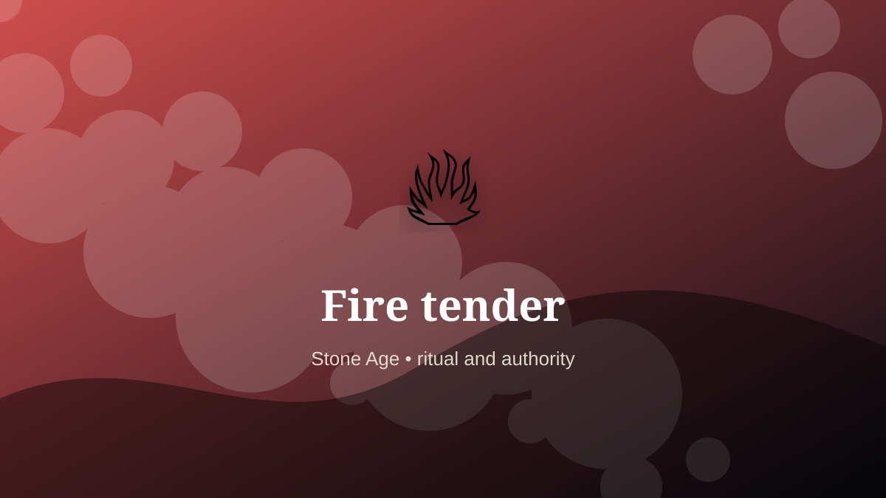

    ---
    title: "Fire tender"
    original_title: "Fire tender"
    era: "Stone Age"
    era_key: "stone"
    atlas_year_reference: "c. 3.3 million years ago–regional metal transitions"
    type: "weird"
    shelf: "ritual"
    evidence: "documented"
    representative_occurrence: "Many regions. Archaeological hearth evidence appears in deep-time African and Eurasian contexts; tending practices varied with fuel, climate, and mobility."
    source_title: "Smithsonian Human Origins: introduction to human evolution"
    source_url: "https://humanorigins.si.edu/education/introduction-human-evolution"
    image: "../assets/images/002-fire-tender.svg"
    ---

    # Fire tender

    

    **Era:** Stone Age  
    **Atlas year reference:** c. 3.3 million years ago–regional metal transitions  
    **Type:** weird  
    **Evidence status:** documented  
    **Shelf:** ritual  
    **Representative occurrence:** Many regions. Archaeological hearth evidence appears in deep-time African and Eurasian contexts; tending practices varied with fuel, climate, and mobility.

    ## Accuracy boundary

    Historically attested role or closely attested work pattern. The wording avoids pretending every region used the same job title or routine.

    ## Rewritten card

    Fire tender sits where technique and legitimacy touch. Not merely “person who makes fire.” A fire tender manages coals, fuel types, smoke, warmth, cooking, predator deterrence, and group continuity.

In the Stone Age, work like this cannot be separated cleanly from belief, law, memory, rank, or public trust. The craft mattered because it produced an outcome other people were willing to recognize as valid. Why it mattered: A portable climate and chemical reactor.

The strange edge is this: Ash and soot become pigment, medicine, and signal. The material act was only half the job. The other half was making the act socially legible.

Representative occurrence: Many regions. Archaeological hearth evidence appears in deep-time African and Eurasian contexts; tending practices varied with fuel, climate, and mobility.

Modern echo: Its modern descendant is visible in adjacent trades, infrastructure, or specialist maintenance work.

Reference lead: Smithsonian Human Origins: introduction to human evolution — https://humanorigins.si.edu/education/introduction-human-evolution

    ## Image guidance

    The included SVG is a local placeholder for offline viewing. For a final public atlas, replace it with a documented image where possible: museum object photo, archaeological reconstruction, historical illustration, workplace photograph, or clearly labeled concept art for speculative cards.

    ## Source lead

    - Smithsonian Human Origins: introduction to human evolution: https://humanorigins.si.edu/education/introduction-human-evolution
