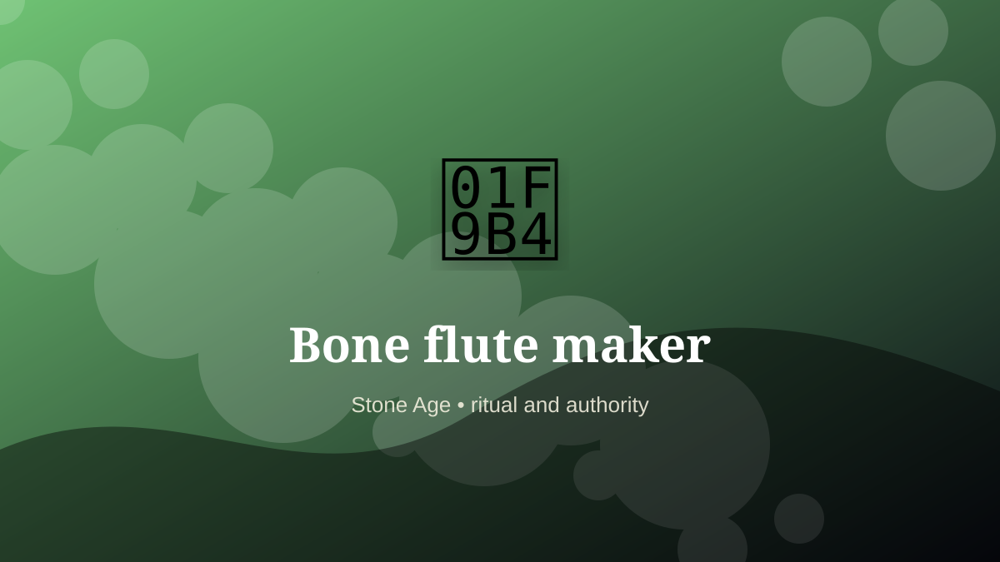

    ---
    title: "Bone flute maker"
    original_title: "Bone flute maker"
    era: "Stone Age"
    era_key: "stone"
    atlas_year_reference: "c. 3.3 million years ago–regional metal transitions"
    type: "weird"
    shelf: "ritual"
    evidence: "documented"
    representative_occurrence: "Especially well known from Upper Paleolithic European finds, with broader analogues in bone, shell, and reed instrument traditions elsewhere."
    source_title: "Smithsonian Human Origins: introduction to human evolution"
    source_url: "https://humanorigins.si.edu/education/introduction-human-evolution"
    image: "../assets/images/004-bone-flute-maker.svg"
    ---

    # Bone flute maker

    

    **Era:** Stone Age  
    **Atlas year reference:** c. 3.3 million years ago–regional metal transitions  
    **Type:** weird  
    **Evidence status:** documented  
    **Shelf:** ritual  
    **Representative occurrence:** Especially well known from Upper Paleolithic European finds, with broader analogues in bone, shell, and reed instrument traditions elsewhere.

    ## Accuracy boundary

    Historically attested role or closely attested work pattern. The wording avoids pretending every region used the same job title or routine.

    ## Rewritten card

    Bone flute maker sits where technique and legitimacy touch. Crafting playable instruments from bird bones and mammoth ivory. A mixture of acoustics, ritual, memory, and fine drilling.

In the Stone Age, work like this cannot be separated cleanly from belief, law, memory, rank, or public trust. The craft mattered because it produced an outcome other people were willing to recognize as valid. Why it mattered: Music becomes social binding technology.

The strange edge is this: The dead animal becomes a voice. The material act was only half the job. The other half was making the act socially legible.

Representative occurrence: Especially well known from Upper Paleolithic European finds, with broader analogues in bone, shell, and reed instrument traditions elsewhere.

Modern echo: Its modern descendant is visible in adjacent trades, infrastructure, or specialist maintenance work.

Reference lead: Smithsonian Human Origins: introduction to human evolution — https://humanorigins.si.edu/education/introduction-human-evolution

    ## Image guidance

    The included SVG is a local placeholder for offline viewing. For a final public atlas, replace it with a documented image where possible: museum object photo, archaeological reconstruction, historical illustration, workplace photograph, or clearly labeled concept art for speculative cards.

    ## Source lead

    - Smithsonian Human Origins: introduction to human evolution: https://humanorigins.si.edu/education/introduction-human-evolution
