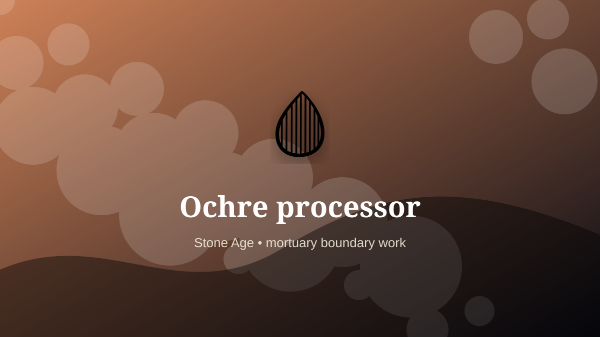

    ---
    title: "Ochre processor"
    original_title: "Ochre processor"
    era: "Stone Age"
    era_key: "stone"
    atlas_year_reference: "c. 3.3 million years ago–regional metal transitions"
    type: "weird"
    shelf: "death"
    evidence: "documented"
    representative_occurrence: "Documented across African, Southwest Asian, European, and Australian contexts, with uses ranging from pigment and marking to funerary and body practices."
    source_title: "Smithsonian Human Origins: introduction to human evolution"
    source_url: "https://humanorigins.si.edu/education/introduction-human-evolution"
    image: "../assets/images/006-ochre-processor.svg"
    ---

    # Ochre processor

    

    **Era:** Stone Age  
    **Atlas year reference:** c. 3.3 million years ago–regional metal transitions  
    **Type:** weird  
    **Evidence status:** documented  
    **Shelf:** death  
    **Representative occurrence:** Documented across African, Southwest Asian, European, and Australian contexts, with uses ranging from pigment and marking to funerary and body practices.

    ## Accuracy boundary

    Historically attested role or closely attested work pattern. The wording avoids pretending every region used the same job title or routine.

    ## Rewritten card

    Ochre processor sits where technique and legitimacy touch. Grinding iron-rich earth into durable pigment for bodies, walls, objects, burials, and identity marks.

In the Stone Age, work like this cannot be separated cleanly from belief, law, memory, rank, or public trust. The craft mattered because it produced an outcome other people were willing to recognize as valid. Why it mattered: Symbolic systems become portable.

The strange edge is this: Red earth links craft, blood, and death. The material act was only half the job. The other half was making the act socially legible.

Representative occurrence: Documented across African, Southwest Asian, European, and Australian contexts, with uses ranging from pigment and marking to funerary and body practices.

Modern echo: Its modern descendant is visible in adjacent trades, infrastructure, or specialist maintenance work.

Reference lead: Smithsonian Human Origins: introduction to human evolution — https://humanorigins.si.edu/education/introduction-human-evolution

    ## Image guidance

    The included SVG is a local placeholder for offline viewing. For a final public atlas, replace it with a documented image where possible: museum object photo, archaeological reconstruction, historical illustration, workplace photograph, or clearly labeled concept art for speculative cards.

    ## Source lead

    - Smithsonian Human Origins: introduction to human evolution: https://humanorigins.si.edu/education/introduction-human-evolution
