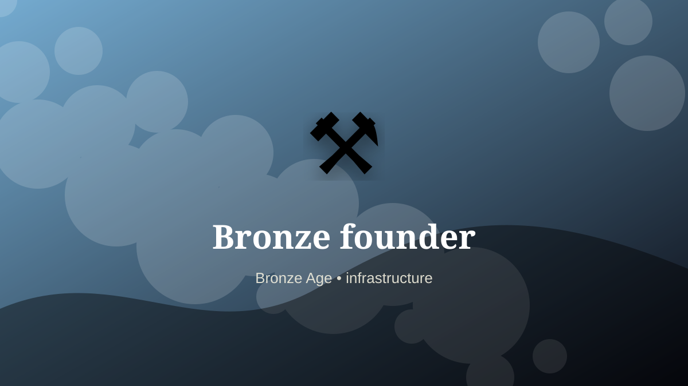

    ---
    title: "Bronze founder"
    original_title: "Bronze founder"
    era: "Bronze Age"
    era_key: "bronze"
    atlas_year_reference: "atlas anchor c. 3300–1200 BCE"
    type: "mainstream"
    shelf: "core"
    evidence: "documented"
    representative_occurrence: "Ancient Southwest Asia, Anatolia, Egypt, the eastern Mediterranean, Europe, South Asia, and East Asia, each with distinct regional metallurgical chronologies."
    source_title: "Smithsonian Human Origins: introduction to human evolution"
    source_url: "https://humanorigins.si.edu/education/introduction-human-evolution"
    image: "../assets/images/007-bronze-founder.svg"
    ---

    # Bronze founder

    

    **Era:** Bronze Age  
    **Atlas year reference:** atlas anchor c. 3300–1200 BCE  
    **Type:** mainstream  
    **Evidence status:** documented  
    **Shelf:** core  
    **Representative occurrence:** Ancient Southwest Asia, Anatolia, Egypt, the eastern Mediterranean, Europe, South Asia, and East Asia, each with distinct regional metallurgical chronologies.

    ## Accuracy boundary

    Historically attested role or closely attested work pattern. The wording avoids pretending every region used the same job title or routine.

    ## Rewritten card

    The work looks narrow until the surrounding system is made visible. Bronze founder was a practical specialist within the Bronze Age. Mining, smelting, alloying, casting, and finishing copper-tin objects. Requires heat control, mold design, and trade networks.

The craft mattered because it stabilized another activity: food, shelter, mobility, trade, recordkeeping, power, repair, or symbolic continuity. Why it mattered: Tools become harder, sharper, reproducible.

The deeper lesson is that ordinary tools often hide extraordinary dependencies. Odd edge: The craft depends on distant tin routes.

Representative occurrence: Ancient Southwest Asia, Anatolia, Egypt, the eastern Mediterranean, Europe, South Asia, and East Asia, each with distinct regional metallurgical chronologies.

Modern echo: Its modern descendant is visible in adjacent trades, infrastructure, or specialist maintenance work.

Reference lead: Smithsonian Human Origins: introduction to human evolution — https://humanorigins.si.edu/education/introduction-human-evolution

    ## Image guidance

    The included SVG is a local placeholder for offline viewing. For a final public atlas, replace it with a documented image where possible: museum object photo, archaeological reconstruction, historical illustration, workplace photograph, or clearly labeled concept art for speculative cards.

    ## Source lead

    - Smithsonian Human Origins: introduction to human evolution: https://humanorigins.si.edu/education/introduction-human-evolution
