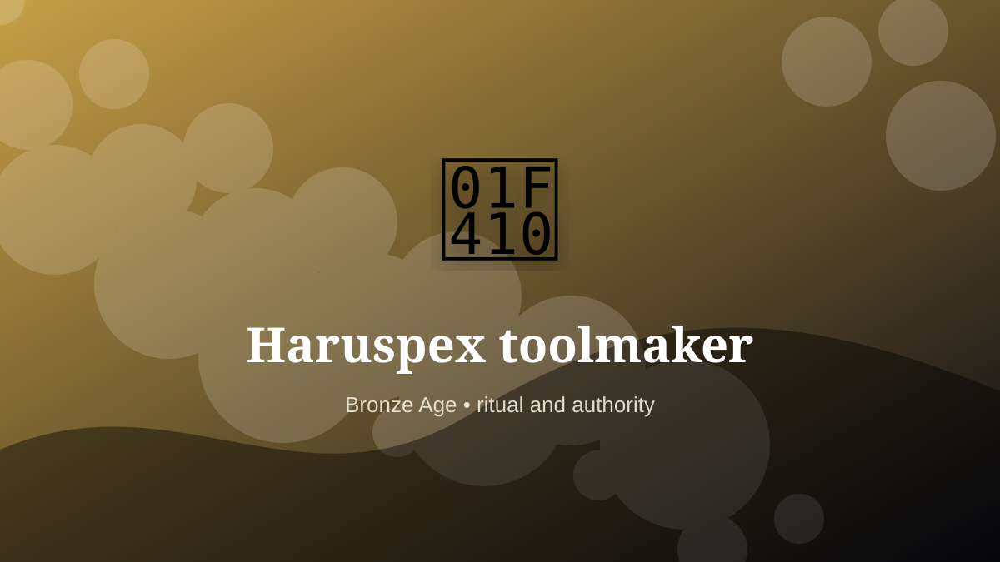

    ---
    title: "Haruspex toolmaker"
    original_title: "Haruspex toolmaker"
    era: "Bronze Age"
    era_key: "bronze"
    atlas_year_reference: "atlas anchor c. 3300–1200 BCE"
    type: "weird"
    shelf: "ritual"
    evidence: "documented"
    representative_occurrence: "Mesopotamian divination traditions and later Etruscan and Roman contexts in the Mediterranean world."
    source_title: "Smithsonian Human Origins: introduction to human evolution"
    source_url: "https://humanorigins.si.edu/education/introduction-human-evolution"
    image: "../assets/images/009-haruspex-toolmaker.svg"
    ---

    # Haruspex toolmaker

    

    **Era:** Bronze Age  
    **Atlas year reference:** atlas anchor c. 3300–1200 BCE  
    **Type:** weird  
    **Evidence status:** documented  
    **Shelf:** ritual  
    **Representative occurrence:** Mesopotamian divination traditions and later Etruscan and Roman contexts in the Mediterranean world.

    ## Accuracy boundary

    Historically attested role or closely attested work pattern. The wording avoids pretending every region used the same job title or routine.

    ## Rewritten card

    Haruspex toolmaker sits where technique and legitimacy touch. Crafting knives, bowls, figurines, and teaching models used in organ-based divination. A trade at the edge of religion, politics, and slaughter.

In the Bronze Age, work like this cannot be separated cleanly from belief, law, memory, rank, or public trust. The craft mattered because it produced an outcome other people were willing to recognize as valid. Why it mattered: Rulers wanted cosmic authorization.

The strange edge is this: A liver could become a political instrument. The material act was only half the job. The other half was making the act socially legible.

Representative occurrence: Mesopotamian divination traditions and later Etruscan and Roman contexts in the Mediterranean world.

Modern echo: Its modern descendant is visible in adjacent trades, infrastructure, or specialist maintenance work.

Reference lead: Smithsonian Human Origins: introduction to human evolution — https://humanorigins.si.edu/education/introduction-human-evolution

    ## Image guidance

    The included SVG is a local placeholder for offline viewing. For a final public atlas, replace it with a documented image where possible: museum object photo, archaeological reconstruction, historical illustration, workplace photograph, or clearly labeled concept art for speculative cards.

    ## Source lead

    - Smithsonian Human Origins: introduction to human evolution: https://humanorigins.si.edu/education/introduction-human-evolution
