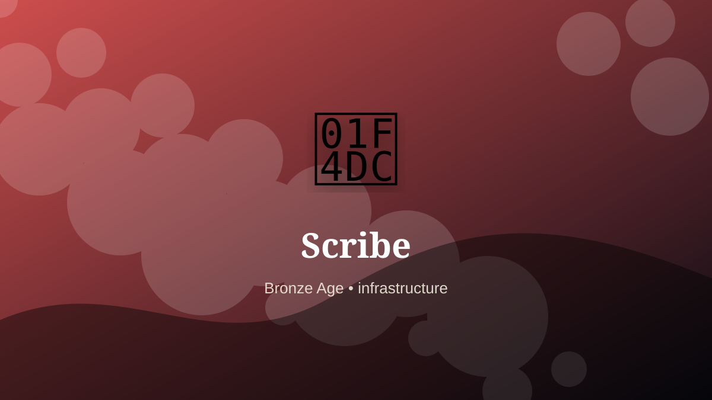

    ---
    title: "Scribe"
    original_title: "Scribe"
    era: "Bronze Age"
    era_key: "bronze"
    atlas_year_reference: "atlas anchor c. 3300–1200 BCE"
    type: "mainstream"
    shelf: "core"
    evidence: "documented"
    representative_occurrence: "Especially Mesopotamia and Egypt, then wider literate administrations across the eastern Mediterranean and other state systems."
    source_title: "Smithsonian Human Origins: introduction to human evolution"
    source_url: "https://humanorigins.si.edu/education/introduction-human-evolution"
    image: "../assets/images/010-scribe.svg"
    ---

    # Scribe

    

    **Era:** Bronze Age  
    **Atlas year reference:** atlas anchor c. 3300–1200 BCE  
    **Type:** mainstream  
    **Evidence status:** documented  
    **Shelf:** core  
    **Representative occurrence:** Especially Mesopotamia and Egypt, then wider literate administrations across the eastern Mediterranean and other state systems.

    ## Accuracy boundary

    Historically attested role or closely attested work pattern. The wording avoids pretending every region used the same job title or routine.

    ## Rewritten card

    The role belongs to the zone where material skill becomes social order. Scribe was a practical specialist within the Bronze Age. Pressing signs into clay, ink on papyrus, or marks onto seals. The trade turns transactions into durable authority.

The craft mattered because it stabilized another activity: food, shelter, mobility, trade, recordkeeping, power, repair, or symbolic continuity. Why it mattered: States need memory.

The deeper lesson is that ordinary tools often hide extraordinary dependencies. Odd edge: Writing begins as logistics before literature.

Representative occurrence: Especially Mesopotamia and Egypt, then wider literate administrations across the eastern Mediterranean and other state systems.

Modern echo: Its modern descendant is visible in adjacent trades, infrastructure, or specialist maintenance work.

Reference lead: Smithsonian Human Origins: introduction to human evolution — https://humanorigins.si.edu/education/introduction-human-evolution

    ## Image guidance

    The included SVG is a local placeholder for offline viewing. For a final public atlas, replace it with a documented image where possible: museum object photo, archaeological reconstruction, historical illustration, workplace photograph, or clearly labeled concept art for speculative cards.

    ## Source lead

    - Smithsonian Human Origins: introduction to human evolution: https://humanorigins.si.edu/education/introduction-human-evolution
