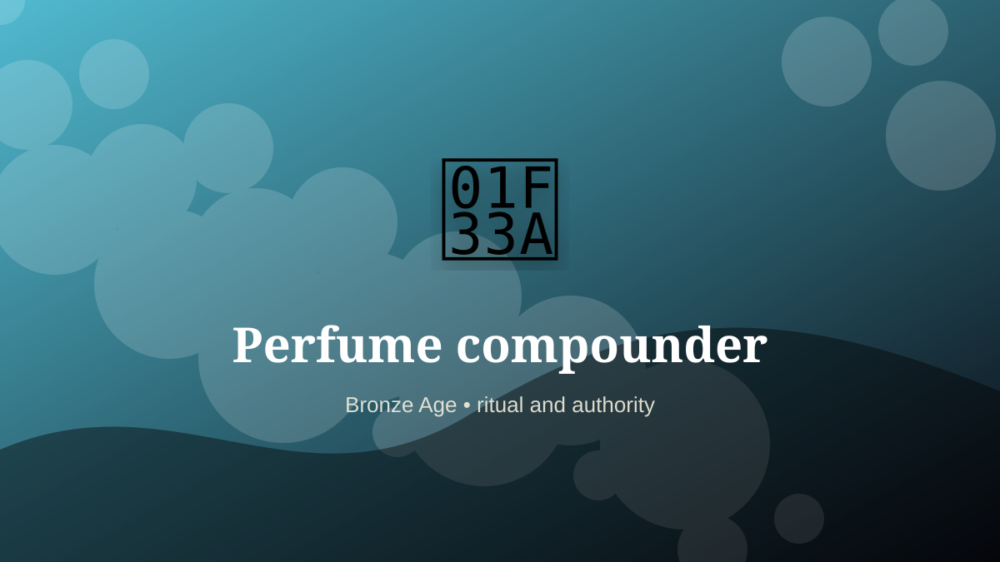

    ---
    title: "Perfume compounder"
    original_title: "Perfume compounder"
    era: "Bronze Age"
    era_key: "bronze"
    atlas_year_reference: "atlas anchor c. 3300–1200 BCE"
    type: "weird"
    shelf: "ritual"
    evidence: "documented"
    representative_occurrence: "Egypt, Mesopotamia, the eastern Mediterranean, Arabia, and South Asia within long-distance aromatic trade networks."
    source_title: "Smithsonian Human Origins: introduction to human evolution"
    source_url: "https://humanorigins.si.edu/education/introduction-human-evolution"
    image: "../assets/images/011-perfume-compounder.svg"
    ---

    # Perfume compounder

    

    **Era:** Bronze Age  
    **Atlas year reference:** atlas anchor c. 3300–1200 BCE  
    **Type:** weird  
    **Evidence status:** documented  
    **Shelf:** ritual  
    **Representative occurrence:** Egypt, Mesopotamia, the eastern Mediterranean, Arabia, and South Asia within long-distance aromatic trade networks.

    ## Accuracy boundary

    Historically attested role or closely attested work pattern. The wording avoids pretending every region used the same job title or routine.

    ## Rewritten card

    Perfume compounder sits where technique and legitimacy touch. Blending oils, resins, flowers, smoke, and spices into scent for temples, bodies, medicine, erotic life, and elite display.

In the Bronze Age, work like this cannot be separated cleanly from belief, law, memory, rank, or public trust. The craft mattered because it produced an outcome other people were willing to recognize as valid. Why it mattered: Scent becomes class and sacred signal.

The strange edge is this: Invisible luxury with huge trade weight. The material act was only half the job. The other half was making the act socially legible.

Representative occurrence: Egypt, Mesopotamia, the eastern Mediterranean, Arabia, and South Asia within long-distance aromatic trade networks.

Modern echo: Its modern descendant is visible in adjacent trades, infrastructure, or specialist maintenance work.

Reference lead: Smithsonian Human Origins: introduction to human evolution — https://humanorigins.si.edu/education/introduction-human-evolution

    ## Image guidance

    The included SVG is a local placeholder for offline viewing. For a final public atlas, replace it with a documented image where possible: museum object photo, archaeological reconstruction, historical illustration, workplace photograph, or clearly labeled concept art for speculative cards.

    ## Source lead

    - Smithsonian Human Origins: introduction to human evolution: https://humanorigins.si.edu/education/introduction-human-evolution
