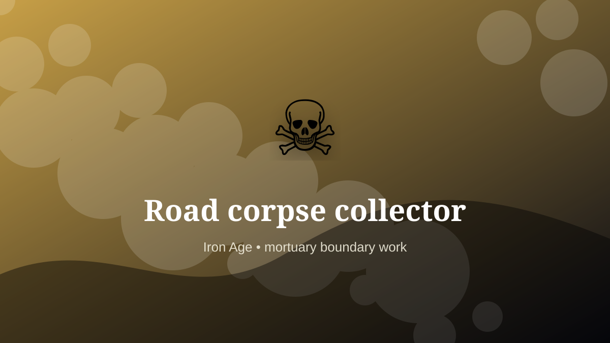

    ---
    title: "Road corpse collector"
    original_title: "Road corpse collector"
    era: "Iron Age"
    era_key: "iron"
    atlas_year_reference: "atlas anchor c. 1200–500 BCE"
    type: "weird"
    shelf: "death"
    evidence: "documented"
    representative_occurrence: "Urban settlements and military contexts in many regions; titles and institutional arrangements vary, but removal work recurs wherever density creates public-health pressure."
    source_title: "Smithsonian Human Origins: introduction to human evolution"
    source_url: "https://humanorigins.si.edu/education/introduction-human-evolution"
    image: "../assets/images/017-road-corpse-collector.svg"
    ---

    # Road corpse collector

    

    **Era:** Iron Age  
    **Atlas year reference:** atlas anchor c. 1200–500 BCE  
    **Type:** weird  
    **Evidence status:** documented  
    **Shelf:** death  
    **Representative occurrence:** Urban settlements and military contexts in many regions; titles and institutional arrangements vary, but removal work recurs wherever density creates public-health pressure.

    ## Accuracy boundary

    Historically attested role or closely attested work pattern. The wording avoids pretending every region used the same job title or routine.

    ## Rewritten card

    Road corpse collector sits where technique and legitimacy touch. A grim urban role: removing dead animals, bodies, refuse, and battlefield remains from roads and settlements.

In the Iron Age, work like this cannot be separated cleanly from belief, law, memory, rank, or public trust. The craft mattered because it produced an outcome other people were willing to recognize as valid. Why it mattered: Disease control before germ theory.

The strange edge is this: Polluted work often becomes caste work. The material act was only half the job. The other half was making the act socially legible.

The card treats this as a public-health removal function rather than a universal formal office.

Representative occurrence: Urban settlements and military contexts in many regions; titles and institutional arrangements vary, but removal work recurs wherever density creates public-health pressure.

Modern echo: Its modern descendant is visible in adjacent trades, infrastructure, or specialist maintenance work.

Reference lead: Smithsonian Human Origins: introduction to human evolution — https://humanorigins.si.edu/education/introduction-human-evolution

    ## Image guidance

    The included SVG is a local placeholder for offline viewing. For a final public atlas, replace it with a documented image where possible: museum object photo, archaeological reconstruction, historical illustration, workplace photograph, or clearly labeled concept art for speculative cards.

    ## Source lead

    - Smithsonian Human Origins: introduction to human evolution: https://humanorigins.si.edu/education/introduction-human-evolution
