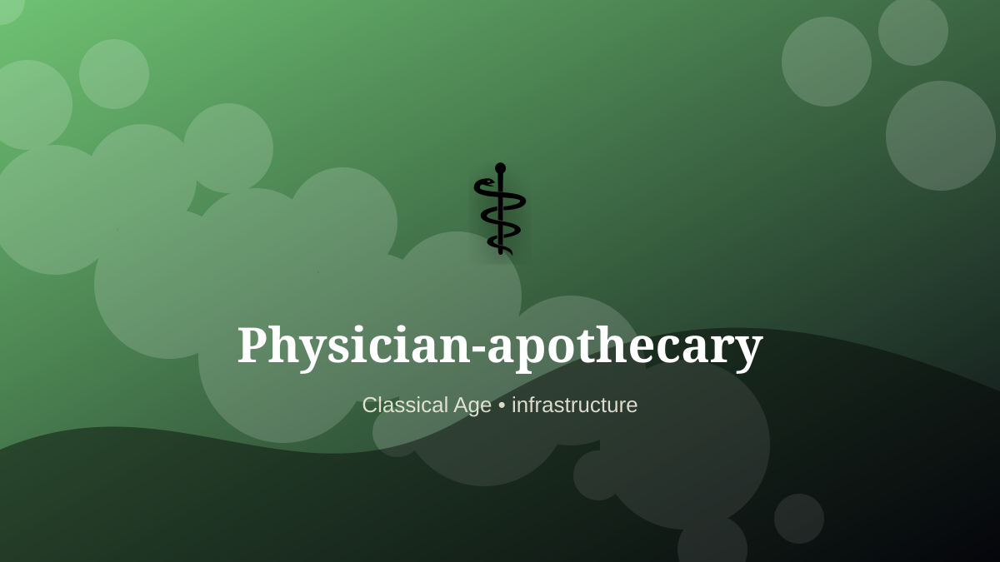

    ---
    title: "Physician-apothecary"
    original_title: "Physician-apothecary"
    era: "Classical Age"
    era_key: "classical"
    atlas_year_reference: "atlas anchor c. 500 BCE–500 CE"
    type: "mainstream"
    shelf: "core"
    evidence: "documented"
    representative_occurrence: "Composite atlas role spanning Mediterranean, Southwest Asian, South Asian, and East Asian medical traditions rather than one standardized occupation."
    source_title: "Smithsonian Human Origins: introduction to human evolution"
    source_url: "https://humanorigins.si.edu/education/introduction-human-evolution"
    image: "../assets/images/020-physician-apothecary.svg"
    ---

    # Physician-apothecary

    

    **Era:** Classical Age  
    **Atlas year reference:** atlas anchor c. 500 BCE–500 CE  
    **Type:** mainstream  
    **Evidence status:** documented  
    **Shelf:** core  
    **Representative occurrence:** Composite atlas role spanning Mediterranean, Southwest Asian, South Asian, and East Asian medical traditions rather than one standardized occupation.

    ## Accuracy boundary

    Historically attested role or closely attested work pattern. The wording avoids pretending every region used the same job title or routine.

    ## Rewritten card

    The role belongs to the zone where material skill becomes social order. Physician-apothecary was a practical specialist within the Classical Age. Blending observation, herbs, minerals, surgery, diet, and theory into treatment. Uneven science, but real practical craft.

The craft mattered because it stabilized another activity: food, shelter, mobility, trade, recordkeeping, power, repair, or symbolic continuity. Why it mattered: Care becomes specialized labor.

The deeper lesson is that ordinary tools often hide extraordinary dependencies. Odd edge: Medicine sat between craft, philosophy, and magic.

Representative occurrence: Composite atlas role spanning Mediterranean, Southwest Asian, South Asian, and East Asian medical traditions rather than one standardized occupation.

Modern echo: Its modern descendant is visible in adjacent trades, infrastructure, or specialist maintenance work.

Reference lead: Smithsonian Human Origins: introduction to human evolution — https://humanorigins.si.edu/education/introduction-human-evolution

    ## Image guidance

    The included SVG is a local placeholder for offline viewing. For a final public atlas, replace it with a documented image where possible: museum object photo, archaeological reconstruction, historical illustration, workplace photograph, or clearly labeled concept art for speculative cards.

    ## Source lead

    - Smithsonian Human Origins: introduction to human evolution: https://humanorigins.si.edu/education/introduction-human-evolution
