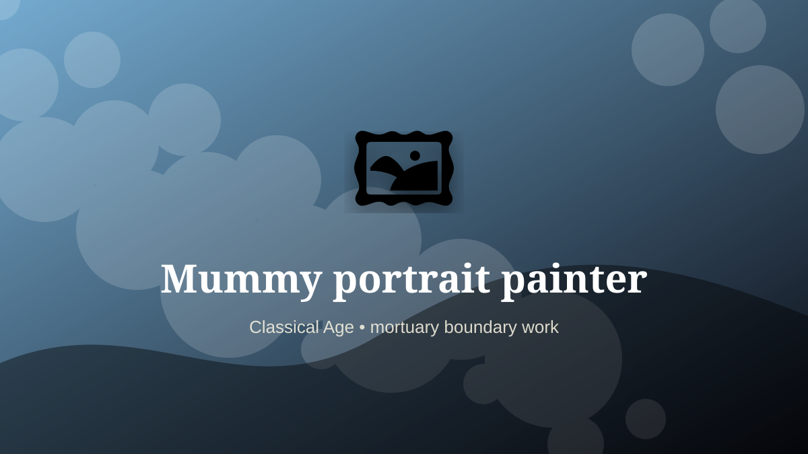

    ---
    title: "Mummy portrait painter"
    original_title: "Mummy portrait painter"
    era: "Classical Age"
    era_key: "classical"
    atlas_year_reference: "atlas anchor c. 500 BCE–500 CE"
    type: "weird"
    shelf: "death"
    evidence: "documented"
    representative_occurrence: "Roman Egypt, especially funerary portrait traditions commonly associated with the Fayum region and related Egyptian contexts."
    source_title: "Smithsonian Human Origins: introduction to human evolution"
    source_url: "https://humanorigins.si.edu/education/introduction-human-evolution"
    image: "../assets/images/023-mummy-portrait-painter.svg"
    ---

    # Mummy portrait painter

    

    **Era:** Classical Age  
    **Atlas year reference:** atlas anchor c. 500 BCE–500 CE  
    **Type:** weird  
    **Evidence status:** documented  
    **Shelf:** death  
    **Representative occurrence:** Roman Egypt, especially funerary portrait traditions commonly associated with the Fayum region and related Egyptian contexts.

    ## Accuracy boundary

    Historically attested role or closely attested work pattern. The wording avoids pretending every region used the same job title or routine.

    ## Rewritten card

    Mummy portrait painter sits where technique and legitimacy touch. Painting lifelike portraits for funerary use, especially encaustic wax panels placed with mummified bodies.

In the Classical Age, work like this cannot be separated cleanly from belief, law, memory, rank, or public trust. The craft mattered because it produced an outcome other people were willing to recognize as valid. Why it mattered: Identity survives ritual transition.

The strange edge is this: The image mediates family, empire, and afterlife. The material act was only half the job. The other half was making the act socially legible.

Representative occurrence: Roman Egypt, especially funerary portrait traditions commonly associated with the Fayum region and related Egyptian contexts.

Modern echo: Its modern descendant is visible in adjacent trades, infrastructure, or specialist maintenance work.

Reference lead: Smithsonian Human Origins: introduction to human evolution — https://humanorigins.si.edu/education/introduction-human-evolution

    ## Image guidance

    The included SVG is a local placeholder for offline viewing. For a final public atlas, replace it with a documented image where possible: museum object photo, archaeological reconstruction, historical illustration, workplace photograph, or clearly labeled concept art for speculative cards.

    ## Source lead

    - Smithsonian Human Origins: introduction to human evolution: https://humanorigins.si.edu/education/introduction-human-evolution
