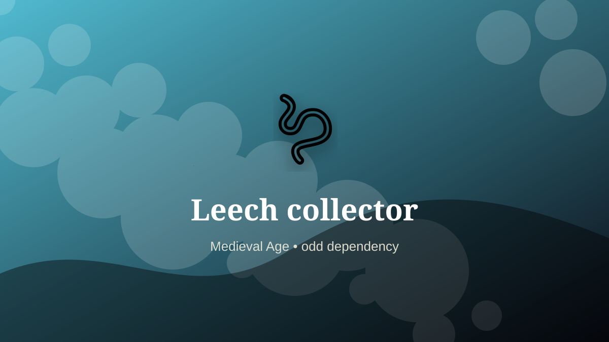

    ---
    title: "Leech collector"
    original_title: "Leech collector"
    era: "Medieval Age"
    era_key: "medieval"
    atlas_year_reference: "atlas anchor c. 500–1500 CE"
    type: "weird"
    shelf: "odd"
    evidence: "documented"
    representative_occurrence: "Europe, the Mediterranean, and many other regions where medicinal leeches entered local medical practice."
    source_title: "Wellcome Collection text archive: historical medicine context"
    source_url: "https://api.wellcomecollection.org/text/v1/b21443348"
    image: "../assets/images/027-leech-collector.svg"
    ---

    # Leech collector

    

    **Era:** Medieval Age  
    **Atlas year reference:** atlas anchor c. 500–1500 CE  
    **Type:** weird  
    **Evidence status:** documented  
    **Shelf:** odd  
    **Representative occurrence:** Europe, the Mediterranean, and many other regions where medicinal leeches entered local medical practice.

    ## Accuracy boundary

    Historically attested role or closely attested work pattern. The wording avoids pretending every region used the same job title or routine.

    ## Rewritten card

    The work looks narrow until the surrounding system is made visible. Leech collector was a practical specialist within the Medieval Age. Gathering medicinal leeches from ponds and marshes, often by using animal or human legs as bait.

The craft mattered because it stabilized another activity: food, shelter, mobility, trade, recordkeeping, power, repair, or symbolic continuity. Why it mattered: Supplied humoral medicine.

The deeper lesson is that ordinary tools often hide extraordinary dependencies. Odd edge: A body could be both tool and bait.

Representative occurrence: Europe, the Mediterranean, and many other regions where medicinal leeches entered local medical practice.

Modern echo: Its modern descendant is visible in adjacent trades, infrastructure, or specialist maintenance work.

Reference lead: Wellcome Collection text archive: historical medicine context — https://api.wellcomecollection.org/text/v1/b21443348

    ## Image guidance

    The included SVG is a local placeholder for offline viewing. For a final public atlas, replace it with a documented image where possible: museum object photo, archaeological reconstruction, historical illustration, workplace photograph, or clearly labeled concept art for speculative cards.

    ## Source lead

    - Wellcome Collection text archive: historical medicine context: https://api.wellcomecollection.org/text/v1/b21443348
