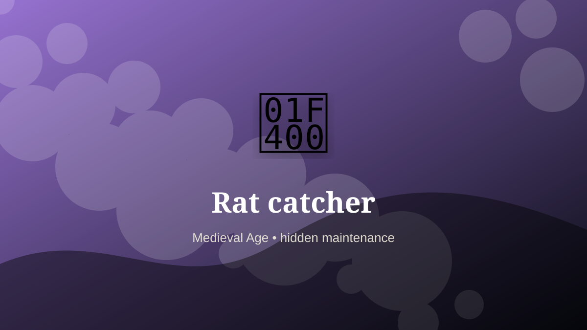

    ---
    title: "Rat catcher"
    original_title: "Rat catcher"
    era: "Medieval Age"
    era_key: "medieval"
    atlas_year_reference: "atlas anchor c. 500–1500 CE"
    type: "weird"
    shelf: "filth"
    evidence: "documented"
    representative_occurrence: "Urban Europe and other dense settlements; the specific title and methods varied, while vermin-control work recurred widely."
    source_title: "Smithsonian Human Origins: introduction to human evolution"
    source_url: "https://humanorigins.si.edu/education/introduction-human-evolution"
    image: "../assets/images/029-rat-catcher.svg"
    ---

    # Rat catcher

    

    **Era:** Medieval Age  
    **Atlas year reference:** atlas anchor c. 500–1500 CE  
    **Type:** weird  
    **Evidence status:** documented  
    **Shelf:** filth  
    **Representative occurrence:** Urban Europe and other dense settlements; the specific title and methods varied, while vermin-control work recurred widely.

    ## Accuracy boundary

    Historically attested role or closely attested work pattern. The wording avoids pretending every region used the same job title or routine.

    ## Rewritten card

    At first glance this is a small craft. In practice, it sits at a pressure point in the society around it. Rat catcher handled the matter, hours, or spaces that more prestigious systems preferred not to face directly. Trapping, poisoning, displaying, and sometimes breeding rats. Both public health role and folk performance.

The work was necessary because settlements, markets, armies, workshops, and households produce residue. Why it mattered: Crowded cities created pest economies.

This is hidden labor. It becomes visible only when it fails, when it smells, when it blocks movement, when disease spreads, or when a cleaner system has not yet been built. Odd edge: Some caught rats for sport pits.

Representative occurrence: Urban Europe and other dense settlements; the specific title and methods varied, while vermin-control work recurred widely.

Modern echo: Its modern descendant is visible in adjacent trades, infrastructure, or specialist maintenance work.

Reference lead: Smithsonian Human Origins: introduction to human evolution — https://humanorigins.si.edu/education/introduction-human-evolution

    ## Image guidance

    The included SVG is a local placeholder for offline viewing. For a final public atlas, replace it with a documented image where possible: museum object photo, archaeological reconstruction, historical illustration, workplace photograph, or clearly labeled concept art for speculative cards.

    ## Source lead

    - Smithsonian Human Origins: introduction to human evolution: https://humanorigins.si.edu/education/introduction-human-evolution
