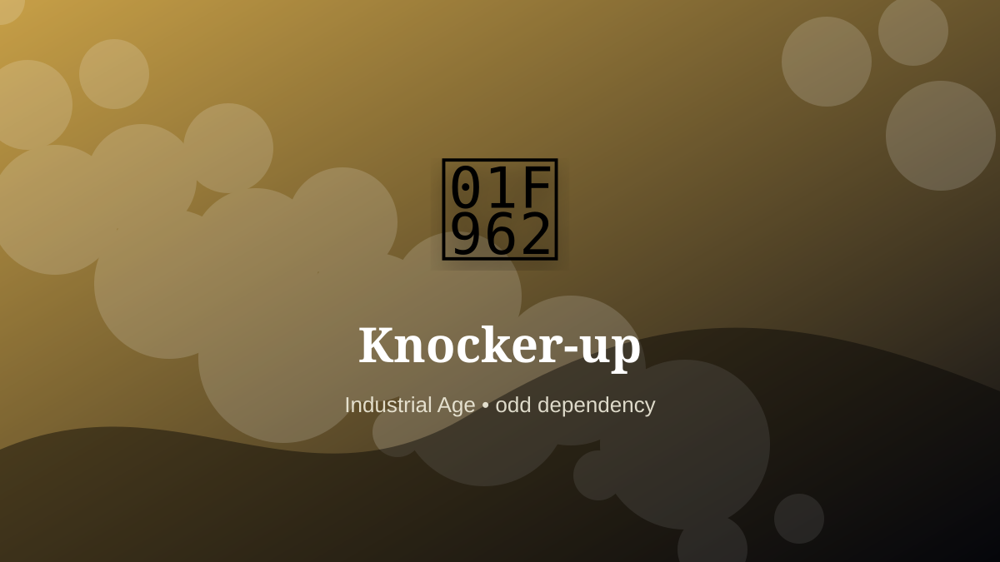

    ---
    title: "Knocker-up"
    original_title: "Knocker-up"
    era: "Industrial Age"
    era_key: "industrial"
    atlas_year_reference: "atlas anchor c. 1750–1950 CE"
    type: "weird"
    shelf: "odd"
    evidence: "documented"
    representative_occurrence: "Especially industrial Britain and Ireland, where human alarm-clock services served workers under factory time discipline."
    source_title: "Oxford University Press: Women in the business of waking industrial Britain"
    source_url: "https://jvc.oup.com/2020/06/12/waking-up-industrial-britain/"
    image: "../assets/images/033-knocker-up.svg"
    ---

    # Knocker-up

    

    **Era:** Industrial Age  
    **Atlas year reference:** atlas anchor c. 1750–1950 CE  
    **Type:** weird  
    **Evidence status:** documented  
    **Shelf:** odd  
    **Representative occurrence:** Especially industrial Britain and Ireland, where human alarm-clock services served workers under factory time discipline.

    ## Accuracy boundary

    Historically attested role or closely attested work pattern. The wording avoids pretending every region used the same job title or routine.

    ## Rewritten card

    The important fact is not only what the worker made, but what became possible because the work was reliable. Knocker-up was a practical specialist within the Industrial Age. Before reliable alarm clocks, workers were awakened by people tapping windows with poles or pea shooters.

The craft mattered because it stabilized another activity: food, shelter, mobility, trade, recordkeeping, power, repair, or symbolic continuity. Why it mattered: Factory time invaded sleep.

The deeper lesson is that ordinary tools often hide extraordinary dependencies. Odd edge: Someone had to wake the waker.

Representative occurrence: Especially industrial Britain and Ireland, where human alarm-clock services served workers under factory time discipline.

Modern echo: Its modern descendant is visible in adjacent trades, infrastructure, or specialist maintenance work.

Reference lead: Oxford University Press: Women in the business of waking industrial Britain — https://jvc.oup.com/2020/06/12/waking-up-industrial-britain/

    ## Image guidance

    The included SVG is a local placeholder for offline viewing. For a final public atlas, replace it with a documented image where possible: museum object photo, archaeological reconstruction, historical illustration, workplace photograph, or clearly labeled concept art for speculative cards.

    ## Source lead

    - Oxford University Press: Women in the business of waking industrial Britain: https://jvc.oup.com/2020/06/12/waking-up-industrial-britain/
