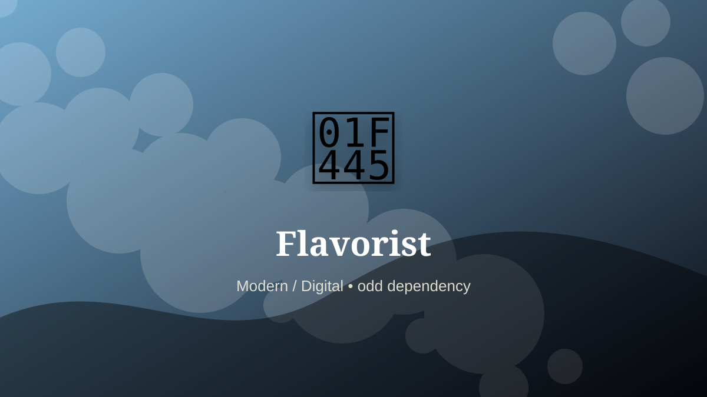

    ---
    title: "Flavorist"
    original_title: "Flavorist"
    era: "Modern / Digital"
    era_key: "modern"
    atlas_year_reference: "atlas lens c. 1950 CE–present"
    type: "weird"
    shelf: "odd"
    evidence: "documented"
    representative_occurrence: "Industrial food, beverage, fragrance-adjacent, and pharmaceutical production centers worldwide."
    source_title: "Smithsonian Human Origins: introduction to human evolution"
    source_url: "https://humanorigins.si.edu/education/introduction-human-evolution"
    image: "../assets/images/039-flavorist.svg"
    ---

    # Flavorist

    

    **Era:** Modern / Digital  
    **Atlas year reference:** atlas lens c. 1950 CE–present  
    **Type:** weird  
    **Evidence status:** documented  
    **Shelf:** odd  
    **Representative occurrence:** Industrial food, beverage, fragrance-adjacent, and pharmaceutical production centers worldwide.

    ## Accuracy boundary

    Historically attested role or closely attested work pattern. The wording avoids pretending every region used the same job title or routine.

    ## Rewritten card

    At first glance this is a small craft. In practice, it sits at a pressure point in the society around it. Flavorist was a practical specialist within the Modern / Digital. Constructing taste and aroma profiles for snacks, drinks, supplements, medicine, and processed foods.

The craft mattered because it stabilized another activity: food, shelter, mobility, trade, recordkeeping, power, repair, or symbolic continuity. Why it mattered: Industrial food needs repeatable desire.

The deeper lesson is that ordinary tools often hide extraordinary dependencies. Odd edge: A strawberry can be rebuilt without a strawberry.

Representative occurrence: Industrial food, beverage, fragrance-adjacent, and pharmaceutical production centers worldwide.

Modern echo: Its modern descendant is visible in adjacent trades, infrastructure, or specialist maintenance work.

Reference lead: Smithsonian Human Origins: introduction to human evolution — https://humanorigins.si.edu/education/introduction-human-evolution

    ## Image guidance

    The included SVG is a local placeholder for offline viewing. For a final public atlas, replace it with a documented image where possible: museum object photo, archaeological reconstruction, historical illustration, workplace photograph, or clearly labeled concept art for speculative cards.

    ## Source lead

    - Smithsonian Human Origins: introduction to human evolution: https://humanorigins.si.edu/education/introduction-human-evolution
