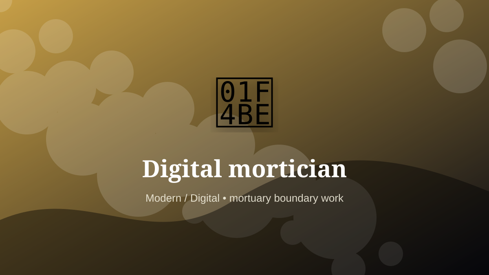

    ---
    title: "Digital mortician"
    original_title: "Digital mortician"
    era: "Modern / Digital"
    era_key: "modern"
    atlas_year_reference: "atlas lens c. 1950 CE–present"
    type: "weird"
    shelf: "death"
    evidence: "documented"
    representative_occurrence: "Global internet and account-governance contexts, shaped by platform rules and local inheritance law."
    source_title: "Smithsonian Human Origins: introduction to human evolution"
    source_url: "https://humanorigins.si.edu/education/introduction-human-evolution"
    image: "../assets/images/041-digital-mortician.svg"
    ---

    # Digital mortician

    

    **Era:** Modern / Digital  
    **Atlas year reference:** atlas lens c. 1950 CE–present  
    **Type:** weird  
    **Evidence status:** documented  
    **Shelf:** death  
    **Representative occurrence:** Global internet and account-governance contexts, shaped by platform rules and local inheritance law.

    ## Accuracy boundary

    Historically attested role or closely attested work pattern. The wording avoids pretending every region used the same job title or routine.

    ## Rewritten card

    Digital mortician sits where technique and legitimacy touch. Managing memorial pages, passwords, legacy archives, AI voice remains, and online identity after death.

In the Modern / Digital, work like this cannot be separated cleanly from belief, law, memory, rank, or public trust. The craft mattered because it produced an outcome other people were willing to recognize as valid. Why it mattered: Death now has a data layer.

The strange edge is this: The ghost is often a login problem. The material act was only half the job. The other half was making the act socially legible.

Representative occurrence: Global internet and account-governance contexts, shaped by platform rules and local inheritance law.

Modern echo: Its modern descendant is visible in adjacent trades, infrastructure, or specialist maintenance work.

Reference lead: Smithsonian Human Origins: introduction to human evolution — https://humanorigins.si.edu/education/introduction-human-evolution

    ## Image guidance

    The included SVG is a local placeholder for offline viewing. For a final public atlas, replace it with a documented image where possible: museum object photo, archaeological reconstruction, historical illustration, workplace photograph, or clearly labeled concept art for speculative cards.

    ## Source lead

    - Smithsonian Human Origins: introduction to human evolution: https://humanorigins.si.edu/education/introduction-human-evolution
