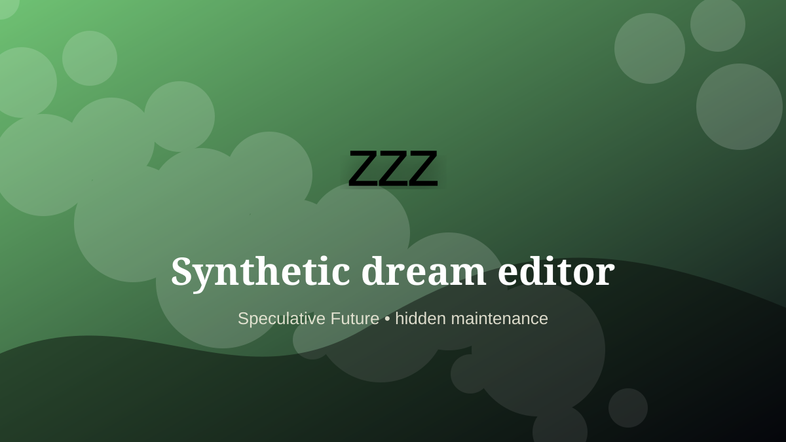

    ---
    title: "Synthetic dream editor"
    original_title: "Synthetic dream editor"
    era: "Speculative Future"
    era_key: "future"
    atlas_year_reference: "speculative near future+"
    type: "weird"
    shelf: "filth"
    evidence: "speculative"
    representative_occurrence: "Scenario-dependent: clinical, wellness, entertainment, and platform environments if neurotechnology matures."
    source_title: "Smithsonian Human Origins: introduction to human evolution"
    source_url: "https://humanorigins.si.edu/education/introduction-human-evolution"
    image: "../assets/images/044-synthetic-dream-editor.svg"
    ---

    # Synthetic dream editor

    

    **Era:** Speculative Future  
    **Atlas year reference:** speculative near future+  
    **Type:** weird  
    **Evidence status:** speculative  
    **Shelf:** filth  
    **Representative occurrence:** Scenario-dependent: clinical, wellness, entertainment, and platform environments if neurotechnology matures.

    ## Accuracy boundary

    Speculative future role. Included as a designed extrapolation, not as an established occupation.

    ## Rewritten card

    At first glance this is a small craft. In practice, it sits at a pressure point in the society around it. Synthetic dream editor handled the matter, hours, or spaces that more prestigious systems preferred not to face directly. Speculative trade: tuning sleep environments, memory prompts, therapeutic dream scripts, and neural replay.

The work was necessary because settlements, markets, armies, workshops, and households produce residue. Why it matters: Rest becomes editable substrate.

This is hidden labor. It becomes visible only when it fails, when it smells, when it blocks movement, when disease spreads, or when a cleaner system has not yet been built. Odd edge: Advertising would try to enter dreams.

This is explicitly a future-facing systems card, not a historical claim.

Representative occurrence: Scenario-dependent: clinical, wellness, entertainment, and platform environments if neurotechnology matures.

Modern echo: Its modern descendant is visible in adjacent trades, infrastructure, or specialist maintenance work.

Reference lead: Smithsonian Human Origins: introduction to human evolution — https://humanorigins.si.edu/education/introduction-human-evolution

    ## Image guidance

    The included SVG is a local placeholder for offline viewing. For a final public atlas, replace it with a documented image where possible: museum object photo, archaeological reconstruction, historical illustration, workplace photograph, or clearly labeled concept art for speculative cards.

    ## Source lead

    - Smithsonian Human Origins: introduction to human evolution: https://humanorigins.si.edu/education/introduction-human-evolution
