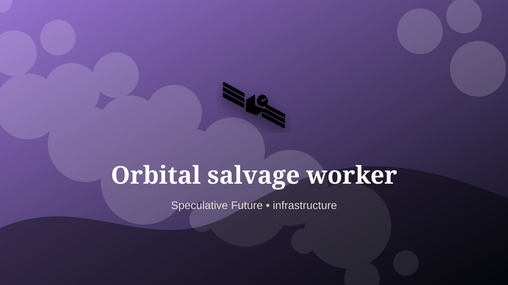

    ---
    title: "Orbital salvage worker"
    original_title: "Orbital salvage worker"
    era: "Speculative Future"
    era_key: "future"
    atlas_year_reference: "speculative near future+"
    type: "mainstream"
    shelf: "core"
    evidence: "speculative"
    representative_occurrence: "Orbital infrastructure and space-industry operations rather than a terrestrial region."
    source_title: "Smithsonian Human Origins: introduction to human evolution"
    source_url: "https://humanorigins.si.edu/education/introduction-human-evolution"
    image: "../assets/images/045-orbital-salvage-worker.svg"
    ---

    # Orbital salvage worker

    

    **Era:** Speculative Future  
    **Atlas year reference:** speculative near future+  
    **Type:** mainstream  
    **Evidence status:** speculative  
    **Shelf:** core  
    **Representative occurrence:** Orbital infrastructure and space-industry operations rather than a terrestrial region.

    ## Accuracy boundary

    Speculative future role. Included as a designed extrapolation, not as an established occupation.

    ## Rewritten card

    Orbital salvage worker is a speculative systems role, not a settled occupation. Capturing, cutting, reusing, or deorbiting satellites and debris using robotics, suits, and remote vehicles.

The reason to include it is that emerging infrastructure creates new responsibility gaps. Why it matters: Space infrastructure needs janitors.

The craft would not merely be technical. It would require governance, auditability, escalation rules, and human judgment at the point where automation becomes ambiguous. Odd edge: Trash becomes orbital ore.

This is explicitly a future-facing systems card, not a historical claim.

Representative occurrence: Orbital infrastructure and space-industry operations rather than a terrestrial region.

Modern echo: Its modern descendant is visible in adjacent trades, infrastructure, or specialist maintenance work.

Reference lead: Smithsonian Human Origins: introduction to human evolution — https://humanorigins.si.edu/education/introduction-human-evolution

    ## Image guidance

    The included SVG is a local placeholder for offline viewing. For a final public atlas, replace it with a documented image where possible: museum object photo, archaeological reconstruction, historical illustration, workplace photograph, or clearly labeled concept art for speculative cards.

    ## Source lead

    - Smithsonian Human Origins: introduction to human evolution: https://humanorigins.si.edu/education/introduction-human-evolution
