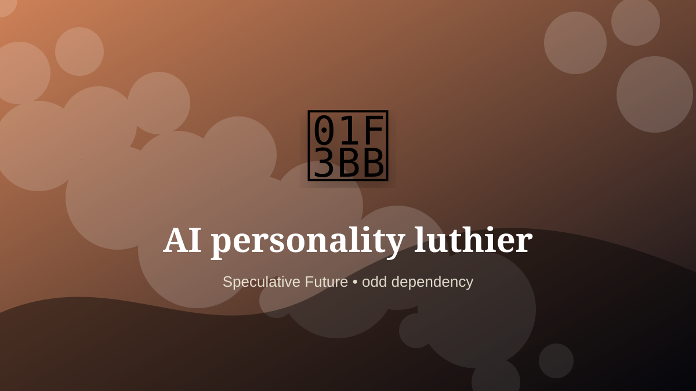

    ---
    title: "AI personality luthier"
    original_title: "AI personality luthier"
    era: "Speculative Future"
    era_key: "future"
    atlas_year_reference: "speculative near future+"
    type: "weird"
    shelf: "odd"
    evidence: "speculative"
    representative_occurrence: "Distributed digital systems, model providers, local deployments, and regulated institutional environments."
    source_title: "Smithsonian Human Origins: introduction to human evolution"
    source_url: "https://humanorigins.si.edu/education/introduction-human-evolution"
    image: "../assets/images/046-ai-personality-luthier.svg"
    ---

    # AI personality luthier

    

    **Era:** Speculative Future  
    **Atlas year reference:** speculative near future+  
    **Type:** weird  
    **Evidence status:** speculative  
    **Shelf:** odd  
    **Representative occurrence:** Distributed digital systems, model providers, local deployments, and regulated institutional environments.

    ## Accuracy boundary

    Speculative future role. Included as a designed extrapolation, not as an established occupation.

    ## Rewritten card

    AI personality luthier is a speculative systems role, not a settled occupation. Shaping model voice, constraints, memory behavior, refusal tone, and task posture like a luthier tunes resonance.

The reason to include it is that emerging infrastructure creates new responsibility gaps. Why it matters: Interfaces need coherent character.

The craft would not merely be technical. It would require governance, auditability, escalation rules, and human judgment at the point where automation becomes ambiguous. Odd edge: Personality becomes a craft layer.

Modern equivalents include conversation design, prompt engineering, alignment evaluation, and model-behavior tuning.

Representative occurrence: Distributed digital systems, model providers, local deployments, and regulated institutional environments.

Modern echo: Its modern descendant is visible in adjacent trades, infrastructure, or specialist maintenance work.

Reference lead: Smithsonian Human Origins: introduction to human evolution — https://humanorigins.si.edu/education/introduction-human-evolution

    ## Image guidance

    The included SVG is a local placeholder for offline viewing. For a final public atlas, replace it with a documented image where possible: museum object photo, archaeological reconstruction, historical illustration, workplace photograph, or clearly labeled concept art for speculative cards.

    ## Source lead

    - Smithsonian Human Origins: introduction to human evolution: https://humanorigins.si.edu/education/introduction-human-evolution
