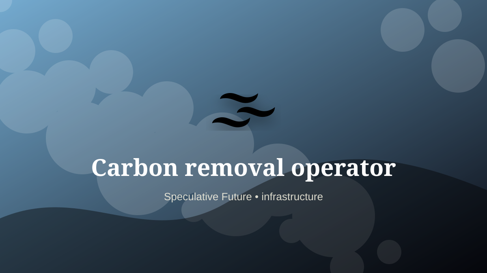

    ---
    title: "Carbon removal operator"
    original_title: "Carbon removal operator"
    era: "Speculative Future"
    era_key: "future"
    atlas_year_reference: "speculative near future+"
    type: "mainstream"
    shelf: "core"
    evidence: "speculative"
    representative_occurrence: "Scenario-dependent planetary distribution: industrial sites, biomass regions, mineralization zones, coasts, and direct-air-capture facilities."
    source_title: "Smithsonian Human Origins: introduction to human evolution"
    source_url: "https://humanorigins.si.edu/education/introduction-human-evolution"
    image: "../assets/images/047-carbon-removal-operator.svg"
    ---

    # Carbon removal operator

    

    **Era:** Speculative Future  
    **Atlas year reference:** speculative near future+  
    **Type:** mainstream  
    **Evidence status:** speculative  
    **Shelf:** core  
    **Representative occurrence:** Scenario-dependent planetary distribution: industrial sites, biomass regions, mineralization zones, coasts, and direct-air-capture facilities.

    ## Accuracy boundary

    Speculative future role. Included as a designed extrapolation, not as an established occupation.

    ## Rewritten card

    Carbon removal operator is a speculative systems role, not a settled occupation. Running machines, mineralization systems, biomass loops, or ocean alkalinity processes that remove carbon.

The reason to include it is that emerging infrastructure creates new responsibility gaps. Why it matters: Industrial cleanup becomes a trade.

The craft would not merely be technical. It would require governance, auditability, escalation rules, and human judgment at the point where automation becomes ambiguous. Odd edge: The atmosphere becomes a worksite.

This is explicitly a future-facing systems card, not a historical claim.

Representative occurrence: Scenario-dependent planetary distribution: industrial sites, biomass regions, mineralization zones, coasts, and direct-air-capture facilities.

Modern echo: Its modern descendant is visible in adjacent trades, infrastructure, or specialist maintenance work.

Reference lead: Smithsonian Human Origins: introduction to human evolution — https://humanorigins.si.edu/education/introduction-human-evolution

    ## Image guidance

    The included SVG is a local placeholder for offline viewing. For a final public atlas, replace it with a documented image where possible: museum object photo, archaeological reconstruction, historical illustration, workplace photograph, or clearly labeled concept art for speculative cards.

    ## Source lead

    - Smithsonian Human Origins: introduction to human evolution: https://humanorigins.si.edu/education/introduction-human-evolution
