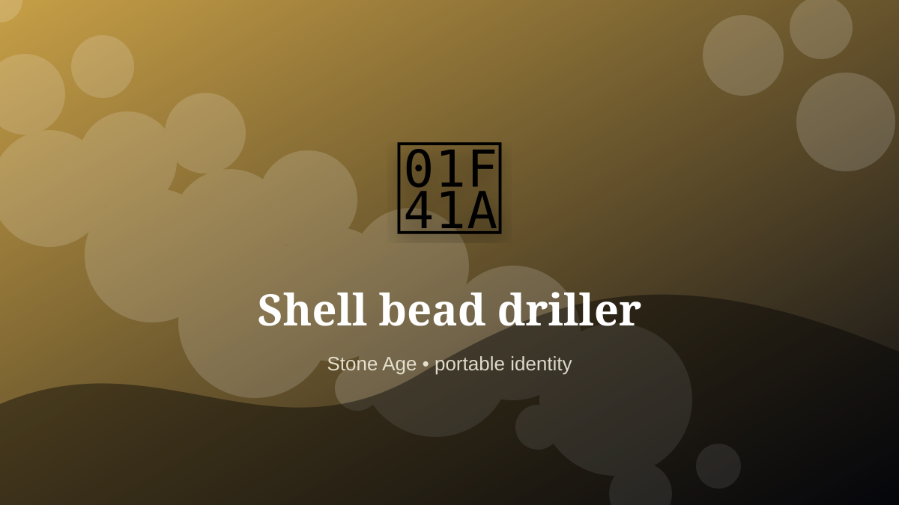

    ---
    title: "Shell bead driller"
    original_title: "Shell bead driller"
    era: "Stone Age"
    era_key: "stone"
    atlas_year_reference: "c. 3.3 million years ago–regional metal transitions"
    type: "mainstream"
    shelf: "ornament"
    evidence: "documented"
    representative_occurrence: "prehistory, many regions"
    source_title: "Smithsonian Human Origins: introduction to human evolution"
    source_url: "https://humanorigins.si.edu/education/introduction-human-evolution"
    image: "../assets/images/049-shell-bead-driller.svg"
    ---

    # Shell bead driller

    

    **Era:** Stone Age  
    **Atlas year reference:** c. 3.3 million years ago–regional metal transitions  
    **Type:** mainstream  
    **Evidence status:** documented  
    **Shelf:** ornament  
    **Representative occurrence:** prehistory, many regions

    ## Accuracy boundary

    Historically attested role or closely attested work pattern. The wording avoids pretending every region used the same job title or routine.

    ## Rewritten card

    Shell bead driller turned perception into craft. Drilling, grinding, and polishing shell into beads turned tiny organic fragments into portable markers of identity, exchange, and belonging.

The role depended on trained discrimination: color, sound, smell, texture, proportion, taste, surface, rhythm, or minute visual difference. Material problem: Brittle shell cracks unless pressure and abrasion are controlled.

Its unusual lesson is that a society often stores value in details too small or too subtle for an untrained observer to notice. Modern echo: Jewelry micro-fabrication and wearable signals.

Representative occurrence: prehistory, many regions

Modern echo: wearable identity

Reference lead: Smithsonian Human Origins: introduction to human evolution — https://humanorigins.si.edu/education/introduction-human-evolution

    ## Image guidance

    The included SVG is a local placeholder for offline viewing. For a final public atlas, replace it with a documented image where possible: museum object photo, archaeological reconstruction, historical illustration, workplace photograph, or clearly labeled concept art for speculative cards.

    ## Source lead

    - Smithsonian Human Origins: introduction to human evolution: https://humanorigins.si.edu/education/introduction-human-evolution
