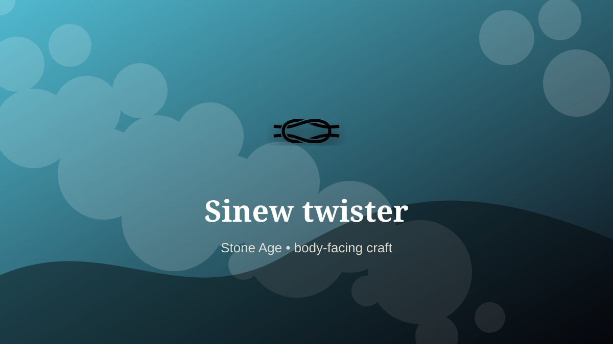

    ---
    title: "Sinew twister"
    original_title: "Sinew twister"
    era: "Stone Age"
    era_key: "stone"
    atlas_year_reference: "c. 3.3 million years ago–regional metal transitions"
    type: "mainstream"
    shelf: "body"
    evidence: "documented"
    representative_occurrence: "prehistory, many regions"
    source_title: "Smithsonian Human Origins: introduction to human evolution"
    source_url: "https://humanorigins.si.edu/education/introduction-human-evolution"
    image: "../assets/images/051-sinew-twister.svg"
    ---

    # Sinew twister

    

    **Era:** Stone Age  
    **Atlas year reference:** c. 3.3 million years ago–regional metal transitions  
    **Type:** mainstream  
    **Evidence status:** documented  
    **Shelf:** body  
    **Representative occurrence:** prehistory, many regions

    ## Accuracy boundary

    Historically attested role or closely attested work pattern. The wording avoids pretending every region used the same job title or routine.

    ## Rewritten card

    Sinew twister required skill under bodily risk. Separating, drying, softening, and twisting tendon fibers into thread, bindings, bowstrings, and reinforcement.

The worker operated near injury, exposure, contamination, misclassification, pain, or irreversible change. Material problem: Strength comes from aligned fibers and controlled moisture.

The value of the work came from judgment under conditions where a mistake could not always be undone. Odd edge: A discarded tendon becomes structural cable.

Representative occurrence: prehistory, many regions

Modern echo: technical textiles

Reference lead: Smithsonian Human Origins: introduction to human evolution — https://humanorigins.si.edu/education/introduction-human-evolution

    ## Image guidance

    The included SVG is a local placeholder for offline viewing. For a final public atlas, replace it with a documented image where possible: museum object photo, archaeological reconstruction, historical illustration, workplace photograph, or clearly labeled concept art for speculative cards.

    ## Source lead

    - Smithsonian Human Origins: introduction to human evolution: https://humanorigins.si.edu/education/introduction-human-evolution
