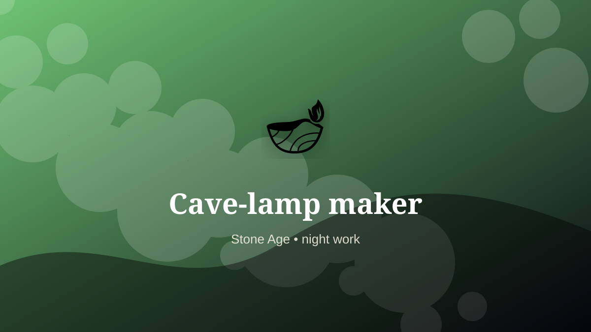

    ---
    title: "Cave-lamp maker"
    original_title: "Cave-lamp maker"
    era: "Stone Age"
    era_key: "stone"
    atlas_year_reference: "c. 3.3 million years ago–regional metal transitions"
    type: "weird"
    shelf: "night"
    evidence: "documented"
    representative_occurrence: "prehistoric cave contexts"
    source_title: "Smithsonian Human Origins: introduction to human evolution"
    source_url: "https://humanorigins.si.edu/education/introduction-human-evolution"
    image: "../assets/images/052-cave-lamp-maker.svg"
    ---

    # Cave-lamp maker

    

    **Era:** Stone Age  
    **Atlas year reference:** c. 3.3 million years ago–regional metal transitions  
    **Type:** weird  
    **Evidence status:** documented  
    **Shelf:** night  
    **Representative occurrence:** prehistoric cave contexts

    ## Accuracy boundary

    Historically attested role or closely attested work pattern. The wording avoids pretending every region used the same job title or routine.

    ## Rewritten card

    The work looks narrow until the surrounding system is made visible. Cave-lamp maker handled the matter, hours, or spaces that more prestigious systems preferred not to face directly. Shaping stone cups or shell lamps and managing fat fuel and wicks extended work, movement, and image-making into deep darkness.

The work was necessary because settlements, markets, armies, workshops, and households produce residue. Why it mattered: Light creates habitable time and space.

This is hidden labor. It becomes visible only when it fails, when it smells, when it blocks movement, when disease spreads, or when a cleaner system has not yet been built. Odd edge: Art begins partly as fuel logistics.

Representative occurrence: prehistoric cave contexts

Modern echo: portable lighting

Reference lead: Smithsonian Human Origins: introduction to human evolution — https://humanorigins.si.edu/education/introduction-human-evolution

    ## Image guidance

    The included SVG is a local placeholder for offline viewing. For a final public atlas, replace it with a documented image where possible: museum object photo, archaeological reconstruction, historical illustration, workplace photograph, or clearly labeled concept art for speculative cards.

    ## Source lead

    - Smithsonian Human Origins: introduction to human evolution: https://humanorigins.si.edu/education/introduction-human-evolution
