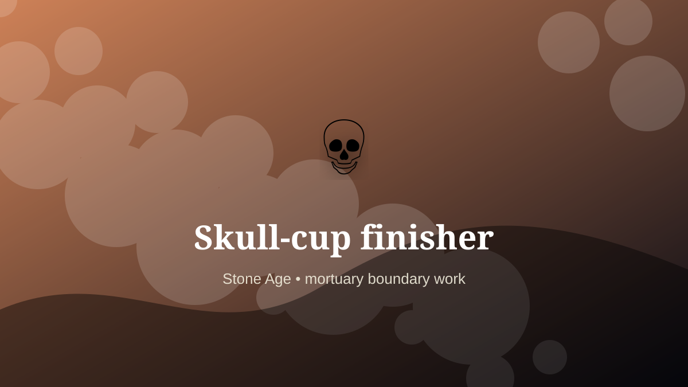

    ---
    title: "Cranial Vessel Maker (Reconstructed)"
    original_title: "Skull-cup finisher"
    era: "Stone Age"
    era_key: "stone"
    atlas_year_reference: "c. 3.3 million years ago–regional metal transitions"
    type: "weird"
    shelf: "death"
    evidence: "borderland"
    representative_occurrence: "selected prehistoric contexts"
    source_title: "Smithsonian Human Origins: introduction to human evolution"
    source_url: "https://humanorigins.si.edu/education/introduction-human-evolution"
    image: "../assets/images/054-skull-cup-finisher.svg"
    ---

    # Cranial Vessel Maker (Reconstructed)

    

    **Era:** Stone Age  
    **Atlas year reference:** c. 3.3 million years ago–regional metal transitions  
    **Type:** weird  
    **Evidence status:** borderland  
    **Shelf:** death  
    **Representative occurrence:** selected prehistoric contexts

    ## Accuracy boundary

    Reconstructed or localized role. The underlying practice or object is grounded, but the occupational boundary is not treated as universal.

    ## Rewritten card

    Cranial Vessel Maker (Reconstructed) sits where technique and legitimacy touch. Cutting and finishing human cranial bone into vessels appears in some archaeological contexts. The role is presented cautiously: the object is documented; the labor title is reconstructed.

In the Stone Age, work like this cannot be separated cleanly from belief, law, memory, rank, or public trust. The craft mattered because it produced an outcome other people were willing to recognize as valid. Evidence note: Object-level evidence, inferred specialist labor.

The strange edge is this: The body becomes container and memory device. The material act was only half the job. The other half was making the act socially legible.

The rewritten title is cautious. Archaeological cranial vessels are real, but this atlas should not imply that “skull-cup finisher” was a standardized profession.

Representative occurrence: selected prehistoric contexts

Modern echo: memorial object craft

Reference lead: Smithsonian Human Origins: introduction to human evolution — https://humanorigins.si.edu/education/introduction-human-evolution

    ## Image guidance

    The included SVG is a local placeholder for offline viewing. For a final public atlas, replace it with a documented image where possible: museum object photo, archaeological reconstruction, historical illustration, workplace photograph, or clearly labeled concept art for speculative cards.

    ## Source lead

    - Smithsonian Human Origins: introduction to human evolution: https://humanorigins.si.edu/education/introduction-human-evolution
