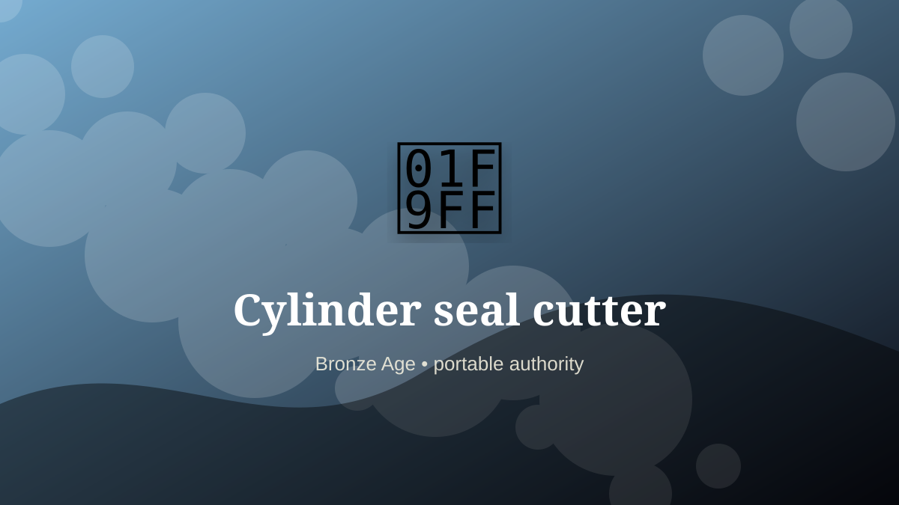

    ---
    title: "Cylinder seal cutter"
    original_title: "Cylinder seal cutter"
    era: "Bronze Age"
    era_key: "bronze"
    atlas_year_reference: "atlas anchor c. 3300–1200 BCE"
    type: "mainstream"
    shelf: "authority"
    evidence: "documented"
    representative_occurrence: "ancient Mesopotamia"
    source_title: "British Museum: Romano-British lead curse tablet"
    source_url: "https://www.britishmuseum.org/collection/object/H_1978-0102-156"
    image: "../assets/images/055-cylinder-seal-cutter.svg"
    ---

    # Cylinder seal cutter

    

    **Era:** Bronze Age  
    **Atlas year reference:** atlas anchor c. 3300–1200 BCE  
    **Type:** mainstream  
    **Evidence status:** documented  
    **Shelf:** authority  
    **Representative occurrence:** ancient Mesopotamia

    ## Accuracy boundary

    Historically attested role or closely attested work pattern. The wording avoids pretending every region used the same job title or routine.

    ## Rewritten card

    Cylinder seal cutter sits where technique and legitimacy touch. Carving mirrored miniature scenes into stone cylinders let a single rolling gesture authenticate clay documents and containers.

In the Bronze Age, work like this cannot be separated cleanly from belief, law, memory, rank, or public trust. The craft mattered because it produced an outcome other people were willing to recognize as valid. Why it mattered: Identity and authorization became mechanically repeatable.

The strange edge is this: A tiny carved stone operates like a credential. The material act was only half the job. The other half was making the act socially legible.

Representative occurrence: ancient Mesopotamia

Modern echo: signature systems

Reference lead: British Museum: Romano-British lead curse tablet — https://www.britishmuseum.org/collection/object/H_1978-0102-156

    ## Image guidance

    The included SVG is a local placeholder for offline viewing. For a final public atlas, replace it with a documented image where possible: museum object photo, archaeological reconstruction, historical illustration, workplace photograph, or clearly labeled concept art for speculative cards.

    ## Source lead

    - British Museum: Romano-British lead curse tablet: https://www.britishmuseum.org/collection/object/H_1978-0102-156
