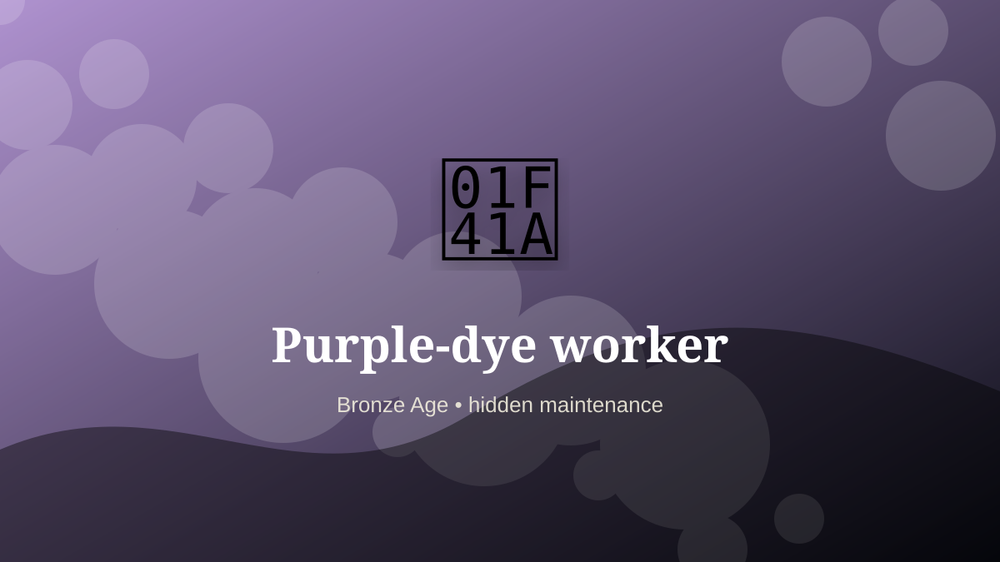

    ---
    title: "Purple-dye worker"
    original_title: "Purple-dye worker"
    era: "Bronze Age"
    era_key: "bronze"
    atlas_year_reference: "atlas anchor c. 3300–1200 BCE"
    type: "weird"
    shelf: "filth"
    evidence: "documented"
    representative_occurrence: "eastern Mediterranean"
    source_title: "Smithsonian: Ancient Egyptian artifacts, mummies, and pyramids"
    source_url: "https://www.si.edu/spotlight/ancient-egypt"
    image: "../assets/images/056-purple-dye-worker.svg"
    ---

    # Purple-dye worker

    

    **Era:** Bronze Age  
    **Atlas year reference:** atlas anchor c. 3300–1200 BCE  
    **Type:** weird  
    **Evidence status:** documented  
    **Shelf:** filth  
    **Representative occurrence:** eastern Mediterranean

    ## Accuracy boundary

    Historically attested role or closely attested work pattern. The wording avoids pretending every region used the same job title or routine.

    ## Rewritten card

    This card is best read as a piece of infrastructure, not as a quaint job title. Purple-dye worker handled the matter, hours, or spaces that more prestigious systems preferred not to face directly. Extracting prestigious purple dye from marine mollusks meant breaking down large numbers of shellfish into a concentrated, expensive color.

The work was necessary because settlements, markets, armies, workshops, and households produce residue. Why it feels strange: Luxury color emerged from decomposing biological matter.

This is hidden labor. It becomes visible only when it fails, when it smells, when it blocks movement, when disease spreads, or when a cleaner system has not yet been built. Modern echo: High-status materials often conceal unpleasant processing.

Representative occurrence: eastern Mediterranean

Modern echo: specialty dye chemistry

Reference lead: Smithsonian: Ancient Egyptian artifacts, mummies, and pyramids — https://www.si.edu/spotlight/ancient-egypt

    ## Image guidance

    The included SVG is a local placeholder for offline viewing. For a final public atlas, replace it with a documented image where possible: museum object photo, archaeological reconstruction, historical illustration, workplace photograph, or clearly labeled concept art for speculative cards.

    ## Source lead

    - Smithsonian: Ancient Egyptian artifacts, mummies, and pyramids: https://www.si.edu/spotlight/ancient-egypt
