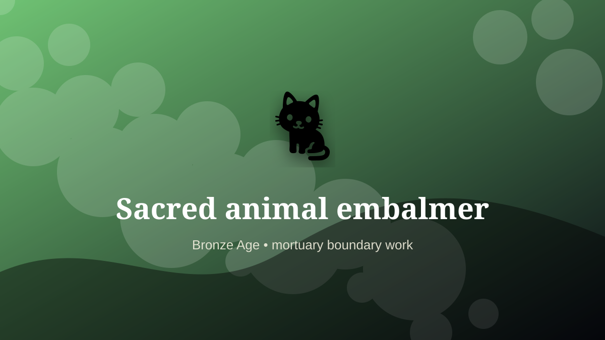

    ---
    title: "Sacred animal embalmer"
    original_title: "Sacred animal embalmer"
    era: "Bronze Age"
    era_key: "bronze"
    atlas_year_reference: "atlas anchor c. 3300–1200 BCE"
    type: "weird"
    shelf: "death"
    evidence: "documented"
    representative_occurrence: "ancient Egypt"
    source_title: "Smithsonian: Ancient Egyptian artifacts, mummies, and pyramids"
    source_url: "https://www.si.edu/spotlight/ancient-egypt"
    image: "../assets/images/060-sacred-animal-embalmer.svg"
    ---

    # Sacred animal embalmer

    

    **Era:** Bronze Age  
    **Atlas year reference:** atlas anchor c. 3300–1200 BCE  
    **Type:** weird  
    **Evidence status:** documented  
    **Shelf:** death  
    **Representative occurrence:** ancient Egypt

    ## Accuracy boundary

    Historically attested role or closely attested work pattern. The wording avoids pretending every region used the same job title or routine.

    ## Rewritten card

    Sacred animal embalmer sits where technique and legitimacy touch. Preparing animal remains for votive and funerary use required repetitive preservation labor tied to temple economies.

In the Bronze Age, work like this cannot be separated cleanly from belief, law, memory, rank, or public trust. The craft mattered because it produced an outcome other people were willing to recognize as valid. Why it mattered: Devotion generated specialized supply chains.

The strange edge is this: Sacred animals became both symbol and inventory. The material act was only half the job. The other half was making the act socially legible.

Representative occurrence: ancient Egypt

Modern echo: specimen preparation

Reference lead: Smithsonian: Ancient Egyptian artifacts, mummies, and pyramids — https://www.si.edu/spotlight/ancient-egypt

    ## Image guidance

    The included SVG is a local placeholder for offline viewing. For a final public atlas, replace it with a documented image where possible: museum object photo, archaeological reconstruction, historical illustration, workplace photograph, or clearly labeled concept art for speculative cards.

    ## Source lead

    - Smithsonian: Ancient Egyptian artifacts, mummies, and pyramids: https://www.si.edu/spotlight/ancient-egypt
