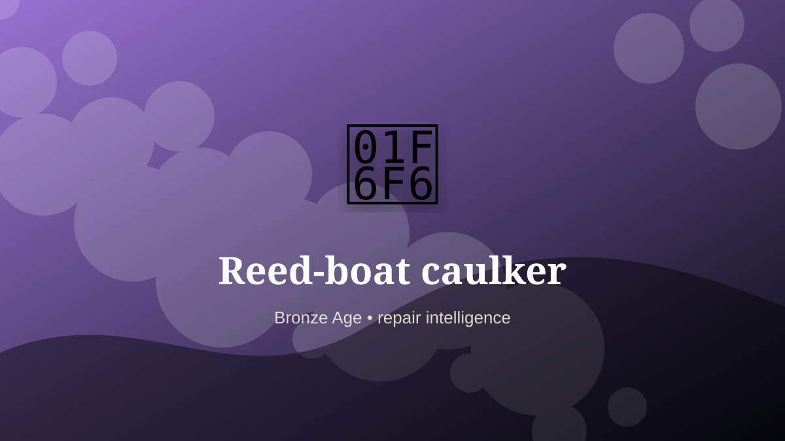

    ---
    title: "Reed-boat caulker"
    original_title: "Reed-boat caulker"
    era: "Bronze Age"
    era_key: "bronze"
    atlas_year_reference: "atlas anchor c. 3300–1200 BCE"
    type: "mainstream"
    shelf: "repair"
    evidence: "documented"
    representative_occurrence: "river civilizations"
    source_title: "Smithsonian: Ancient Egyptian artifacts, mummies, and pyramids"
    source_url: "https://www.si.edu/spotlight/ancient-egypt"
    image: "../assets/images/061-reed-boat-caulker.svg"
    ---

    # Reed-boat caulker

    

    **Era:** Bronze Age  
    **Atlas year reference:** atlas anchor c. 3300–1200 BCE  
    **Type:** mainstream  
    **Evidence status:** documented  
    **Shelf:** repair  
    **Representative occurrence:** river civilizations

    ## Accuracy boundary

    Historically attested role or closely attested work pattern. The wording avoids pretending every region used the same job title or routine.

    ## Rewritten card

    Reed-boat caulker was a material-intelligence role. Binding reed bundles and maintaining seams made shallow-water transport possible with local organic materials.

The worker had to read behavior in heat, fracture, grain, airflow, moisture, season, wear, or chemical change. Material problem: Flexible hulls need continual repair.

This kind of craft preserves tacit knowledge: the timing, touch, color, sound, or resistance that tells a worker when a process has crossed the line from useful to ruined. Modern echo: Maintenance is often the hidden half of mobility.

Representative occurrence: river civilizations

Modern echo: composite maintenance

Reference lead: Smithsonian: Ancient Egyptian artifacts, mummies, and pyramids — https://www.si.edu/spotlight/ancient-egypt

    ## Image guidance

    The included SVG is a local placeholder for offline viewing. For a final public atlas, replace it with a documented image where possible: museum object photo, archaeological reconstruction, historical illustration, workplace photograph, or clearly labeled concept art for speculative cards.

    ## Source lead

    - Smithsonian: Ancient Egyptian artifacts, mummies, and pyramids: https://www.si.edu/spotlight/ancient-egypt
