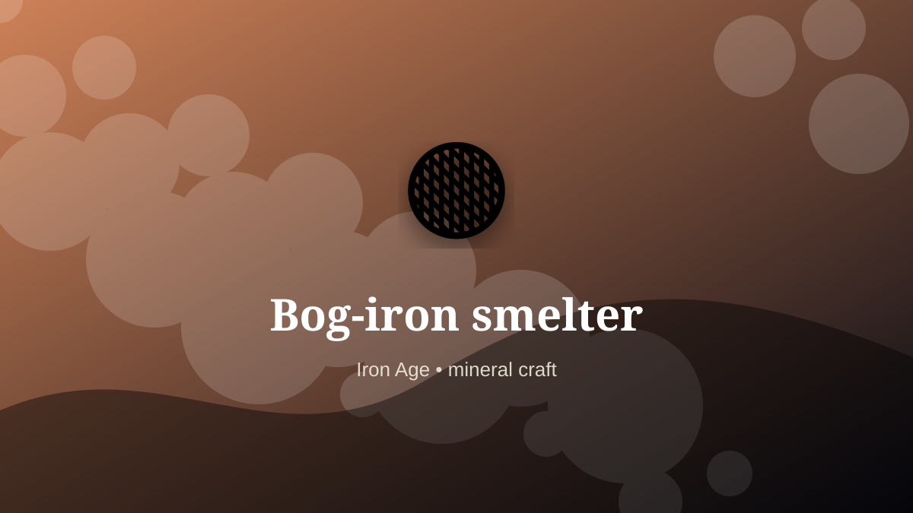

    ---
    title: "Bog-iron smelter"
    original_title: "Bog-iron smelter"
    era: "Iron Age"
    era_key: "iron"
    atlas_year_reference: "atlas anchor c. 1200–500 BCE"
    type: "weird"
    shelf: "mineral"
    evidence: "documented"
    representative_occurrence: "northern Europe and elsewhere"
    source_title: "Smithsonian Human Origins: introduction to human evolution"
    source_url: "https://humanorigins.si.edu/education/introduction-human-evolution"
    image: "../assets/images/062-bog-iron-smelter.svg"
    ---

    # Bog-iron smelter

    

    **Era:** Iron Age  
    **Atlas year reference:** atlas anchor c. 1200–500 BCE  
    **Type:** weird  
    **Evidence status:** documented  
    **Shelf:** mineral  
    **Representative occurrence:** northern Europe and elsewhere

    ## Accuracy boundary

    Historically attested role or closely attested work pattern. The wording avoids pretending every region used the same job title or routine.

    ## Rewritten card

    Bog-iron smelter was a material-intelligence role. Gathering iron-rich deposits from wetlands and transforming them in small furnaces required reading landscape chemistry before geology was formalized.

The worker had to read behavior in heat, fracture, grain, airflow, moisture, season, wear, or chemical change. Why it feels strange: Metal can appear to grow back in a bog.

This kind of craft preserves tacit knowledge: the timing, touch, color, sound, or resistance that tells a worker when a process has crossed the line from useful to ruined. Modern echo: Resource work begins with pattern recognition in terrain.

Representative occurrence: northern Europe and elsewhere

Modern echo: field metallurgy

Reference lead: Smithsonian Human Origins: introduction to human evolution — https://humanorigins.si.edu/education/introduction-human-evolution

    ## Image guidance

    The included SVG is a local placeholder for offline viewing. For a final public atlas, replace it with a documented image where possible: museum object photo, archaeological reconstruction, historical illustration, workplace photograph, or clearly labeled concept art for speculative cards.

    ## Source lead

    - Smithsonian Human Origins: introduction to human evolution: https://humanorigins.si.edu/education/introduction-human-evolution
