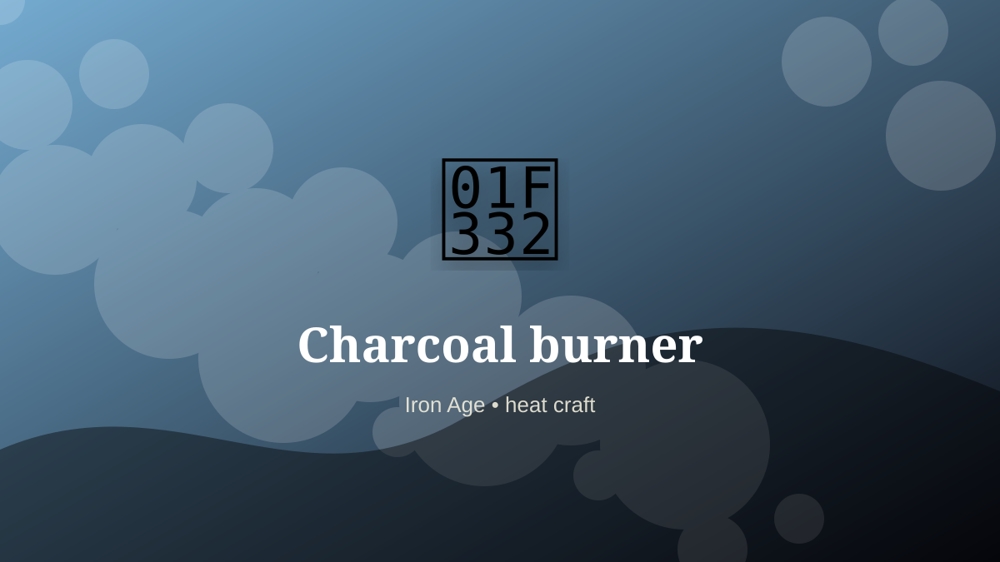

    ---
    title: "Charcoal burner"
    original_title: "Charcoal burner"
    era: "Iron Age"
    era_key: "iron"
    atlas_year_reference: "atlas anchor c. 1200–500 BCE"
    type: "weird"
    shelf: "fire"
    evidence: "documented"
    representative_occurrence: "many regions"
    source_title: "Science History Institute: occupational medicine and toxic work"
    source_url: "https://www.sciencehistory.org/stories/distillations-pod/the-alchemical-origins-of-occupational-medicine/"
    image: "../assets/images/063-charcoal-burner.svg"
    ---

    # Charcoal burner

    

    **Era:** Iron Age  
    **Atlas year reference:** atlas anchor c. 1200–500 BCE  
    **Type:** weird  
    **Evidence status:** documented  
    **Shelf:** fire  
    **Representative occurrence:** many regions

    ## Accuracy boundary

    Historically attested role or closely attested work pattern. The wording avoids pretending every region used the same job title or routine.

    ## Rewritten card

    Charcoal burner was a material-intelligence role. Slow-burning wood under restricted oxygen produced concentrated fuel for metalworking, glass, and lime. The craft demanded constant monitoring and isolation.

The worker had to read behavior in heat, fracture, grain, airflow, moisture, season, wear, or chemical change. Why it mattered: A forge depends on an upstream forest technology.

This kind of craft preserves tacit knowledge: the timing, touch, color, sound, or resistance that tells a worker when a process has crossed the line from useful to ruined. Odd edge: The worker tends an intentionally incomplete fire.

Representative occurrence: many regions

Modern echo: industrial feedstock

Reference lead: Science History Institute: occupational medicine and toxic work — https://www.sciencehistory.org/stories/distillations-pod/the-alchemical-origins-of-occupational-medicine/

    ## Image guidance

    The included SVG is a local placeholder for offline viewing. For a final public atlas, replace it with a documented image where possible: museum object photo, archaeological reconstruction, historical illustration, workplace photograph, or clearly labeled concept art for speculative cards.

    ## Source lead

    - Science History Institute: occupational medicine and toxic work: https://www.sciencehistory.org/stories/distillations-pod/the-alchemical-origins-of-occupational-medicine/
