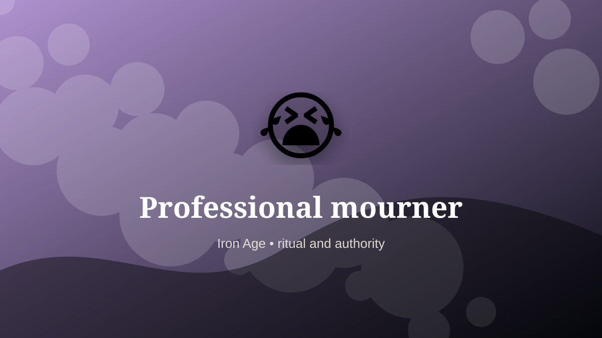

    ---
    title: "Professional mourner"
    original_title: "Professional mourner"
    era: "Iron Age"
    era_key: "iron"
    atlas_year_reference: "atlas anchor c. 1200–500 BCE"
    type: "weird"
    shelf: "ritual"
    evidence: "borderland"
    representative_occurrence: "many regions"
    source_title: "British Museum: Romano-British lead curse tablet"
    source_url: "https://www.britishmuseum.org/collection/object/H_1978-0102-156"
    image: "../assets/images/064-professional-mourner.svg"
    ---

    # Professional mourner

    

    **Era:** Iron Age  
    **Atlas year reference:** atlas anchor c. 1200–500 BCE  
    **Type:** weird  
    **Evidence status:** borderland  
    **Shelf:** ritual  
    **Representative occurrence:** many regions

    ## Accuracy boundary

    Reconstructed or localized role. The underlying practice or object is grounded, but the occupational boundary is not treated as universal.

    ## Rewritten card

    Professional mourner sits where technique and legitimacy touch. Paid or socially designated mourners amplified public grief through voice, gesture, and presence.

In the Iron Age, work like this cannot be separated cleanly from belief, law, memory, rank, or public trust. The craft mattered because it produced an outcome other people were willing to recognize as valid. Evidence note: Practices vary widely; some were formalized and some communal.

The strange edge is this: Emotion becomes skilled ceremonial labor. The material act was only half the job. The other half was making the act socially legible.

Representative occurrence: many regions

Modern echo: ceremonial performance

Reference lead: British Museum: Romano-British lead curse tablet — https://www.britishmuseum.org/collection/object/H_1978-0102-156

    ## Image guidance

    The included SVG is a local placeholder for offline viewing. For a final public atlas, replace it with a documented image where possible: museum object photo, archaeological reconstruction, historical illustration, workplace photograph, or clearly labeled concept art for speculative cards.

    ## Source lead

    - British Museum: Romano-British lead curse tablet: https://www.britishmuseum.org/collection/object/H_1978-0102-156
