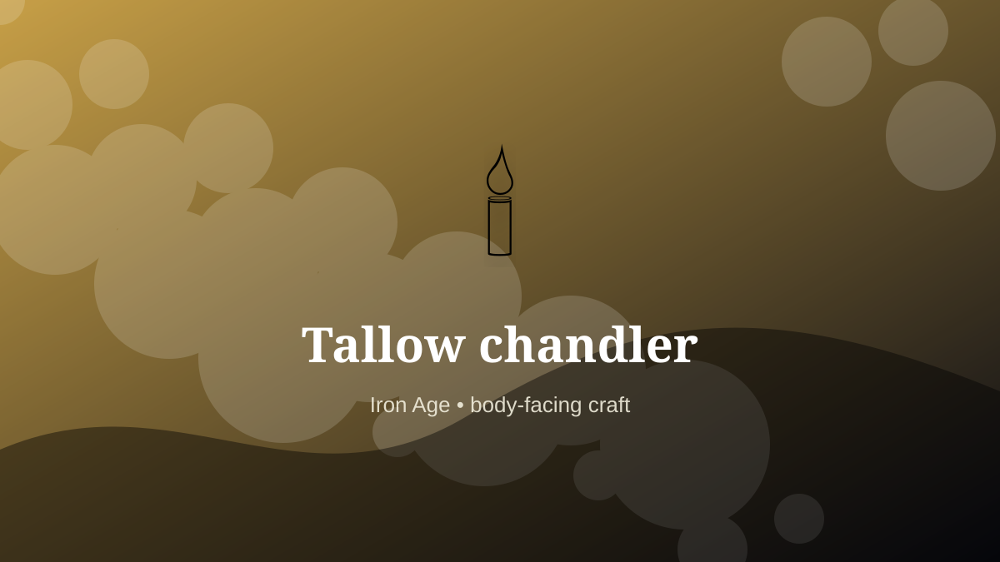

    ---
    title: "Tallow chandler"
    original_title: "Tallow chandler"
    era: "Iron Age"
    era_key: "iron"
    atlas_year_reference: "atlas anchor c. 1200–500 BCE"
    type: "mainstream"
    shelf: "body"
    evidence: "documented"
    representative_occurrence: "many regions"
    source_title: "Newcastle Castle: Gong farmer"
    source_url: "https://www.newcastlecastle.co.uk/castle-blog/gong-farmer"
    image: "../assets/images/065-tallow-chandler.svg"
    ---

    # Tallow chandler

    

    **Era:** Iron Age  
    **Atlas year reference:** atlas anchor c. 1200–500 BCE  
    **Type:** mainstream  
    **Evidence status:** documented  
    **Shelf:** body  
    **Representative occurrence:** many regions

    ## Accuracy boundary

    Historically attested role or closely attested work pattern. The wording avoids pretending every region used the same job title or routine.

    ## Rewritten card

    Tallow chandler required skill under bodily risk. Rendering animal fat and forming candles turned slaughter by-products into domestic time-extension.

The worker operated near injury, exposure, contamination, misclassification, pain, or irreversible change. Why it mattered: Light after sunset was manufactured labor.

The value of the work came from judgment under conditions where a mistake could not always be undone. Odd edge: The household flame begins in a rendering pot.

Representative occurrence: many regions

Modern echo: lighting manufacture

Reference lead: Newcastle Castle: Gong farmer — https://www.newcastlecastle.co.uk/castle-blog/gong-farmer

    ## Image guidance

    The included SVG is a local placeholder for offline viewing. For a final public atlas, replace it with a documented image where possible: museum object photo, archaeological reconstruction, historical illustration, workplace photograph, or clearly labeled concept art for speculative cards.

    ## Source lead

    - Newcastle Castle: Gong farmer: https://www.newcastlecastle.co.uk/castle-blog/gong-farmer
