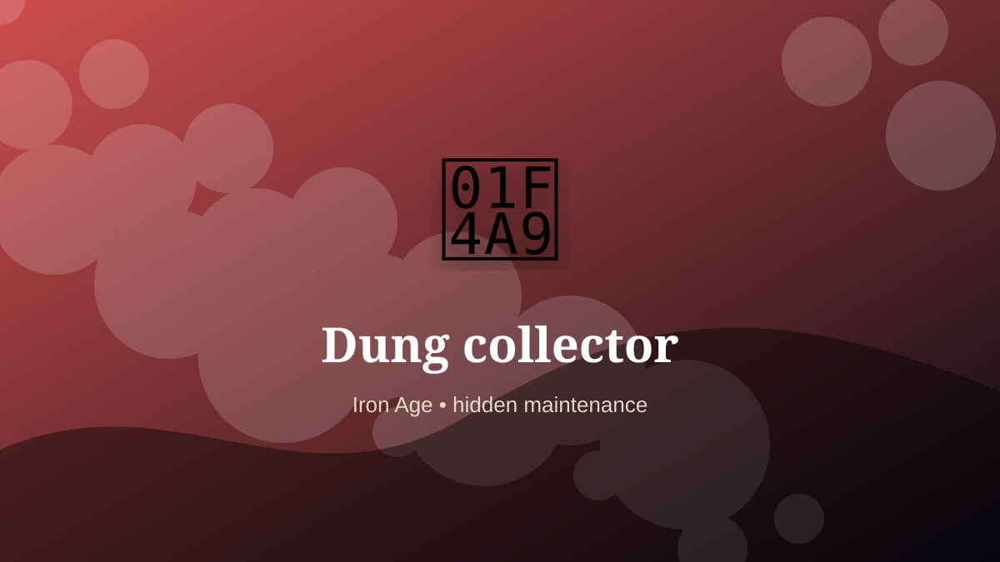

    ---
    title: "Dung collector"
    original_title: "Dung collector"
    era: "Iron Age"
    era_key: "iron"
    atlas_year_reference: "atlas anchor c. 1200–500 BCE"
    type: "weird"
    shelf: "filth"
    evidence: "borderland"
    representative_occurrence: "urban settlements"
    source_title: "Newcastle Castle: Gong farmer"
    source_url: "https://www.newcastlecastle.co.uk/castle-blog/gong-farmer"
    image: "../assets/images/066-dung-collector.svg"
    ---

    # Dung collector

    

    **Era:** Iron Age  
    **Atlas year reference:** atlas anchor c. 1200–500 BCE  
    **Type:** weird  
    **Evidence status:** borderland  
    **Shelf:** filth  
    **Representative occurrence:** urban settlements

    ## Accuracy boundary

    Reconstructed or localized role. The underlying practice or object is grounded, but the occupational boundary is not treated as universal.

    ## Rewritten card

    This card is best read as a piece of infrastructure, not as a quaint job title. Dung collector handled the matter, hours, or spaces that more prestigious systems preferred not to face directly. Animal waste from roads, stables, and markets could be collected, moved, and sold as fertilizer or process input.

The work was necessary because settlements, markets, armies, workshops, and households produce residue. Why it mattered: Cities create by-products before they create sanitation.

This is hidden labor. It becomes visible only when it fails, when it smells, when it blocks movement, when disease spreads, or when a cleaner system has not yet been built. Odd edge: Waste becomes a tradable substrate.

Representative occurrence: urban settlements

Modern echo: circular economy

Reference lead: Newcastle Castle: Gong farmer — https://www.newcastlecastle.co.uk/castle-blog/gong-farmer

    ## Image guidance

    The included SVG is a local placeholder for offline viewing. For a final public atlas, replace it with a documented image where possible: museum object photo, archaeological reconstruction, historical illustration, workplace photograph, or clearly labeled concept art for speculative cards.

    ## Source lead

    - Newcastle Castle: Gong farmer: https://www.newcastlecastle.co.uk/castle-blog/gong-farmer
