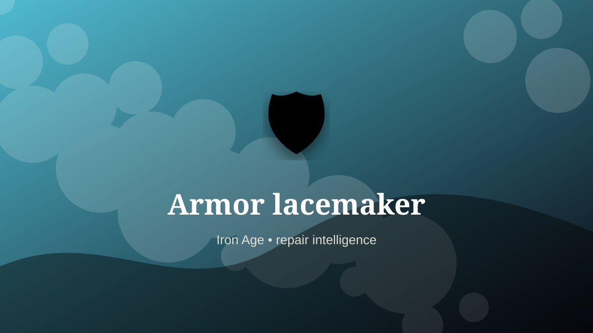

    ---
    title: "Armor lacemaker"
    original_title: "Armor lacemaker"
    era: "Iron Age"
    era_key: "iron"
    atlas_year_reference: "atlas anchor c. 1200–500 BCE"
    type: "mainstream"
    shelf: "repair"
    evidence: "documented"
    representative_occurrence: "many regions"
    source_title: "Smithsonian Human Origins: introduction to human evolution"
    source_url: "https://humanorigins.si.edu/education/introduction-human-evolution"
    image: "../assets/images/067-armor-lacemaker.svg"
    ---

    # Armor lacemaker

    

    **Era:** Iron Age  
    **Atlas year reference:** atlas anchor c. 1200–500 BCE  
    **Type:** mainstream  
    **Evidence status:** documented  
    **Shelf:** repair  
    **Representative occurrence:** many regions

    ## Accuracy boundary

    Historically attested role or closely attested work pattern. The wording avoids pretending every region used the same job title or routine.

    ## Rewritten card

    Armor lacemaker was a material-intelligence role. Connecting plates, padding, mail, straps, and cords required flexible joining knowledge alongside metalwork.

The worker had to read behavior in heat, fracture, grain, airflow, moisture, season, wear, or chemical change. Why it mattered: Protection is a system, not a single forged object.

This kind of craft preserves tacit knowledge: the timing, touch, color, sound, or resistance that tells a worker when a process has crossed the line from useful to ruined. Odd edge: Soft materials govern hard armor.

Representative occurrence: many regions

Modern echo: wearable systems

Reference lead: Smithsonian Human Origins: introduction to human evolution — https://humanorigins.si.edu/education/introduction-human-evolution

    ## Image guidance

    The included SVG is a local placeholder for offline viewing. For a final public atlas, replace it with a documented image where possible: museum object photo, archaeological reconstruction, historical illustration, workplace photograph, or clearly labeled concept art for speculative cards.

    ## Source lead

    - Smithsonian Human Origins: introduction to human evolution: https://humanorigins.si.edu/education/introduction-human-evolution
