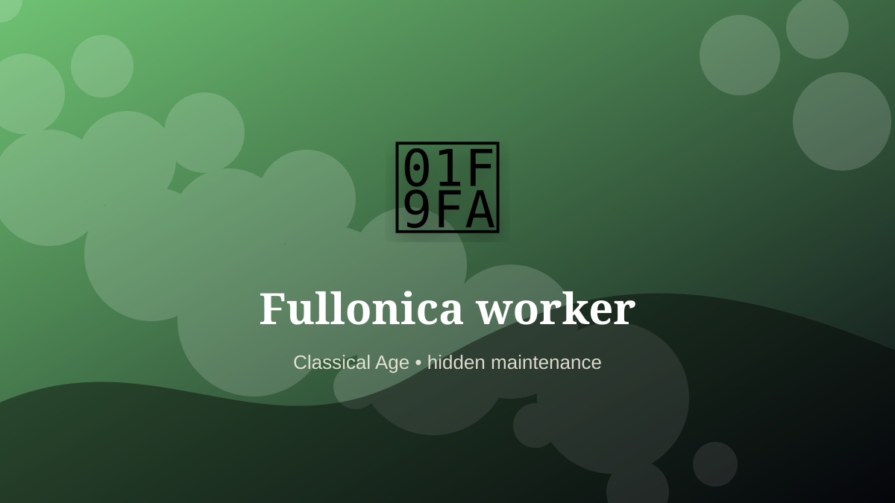

    ---
    title: "Fullonica worker"
    original_title: "Fullonica worker"
    era: "Classical Age"
    era_key: "classical"
    atlas_year_reference: "atlas anchor c. 500 BCE–500 CE"
    type: "weird"
    shelf: "filth"
    evidence: "documented"
    representative_occurrence: "Roman world"
    source_title: "Merriam-Webster: fuller"
    source_url: "https://www.merriam-webster.com/dictionary/fuller"
    image: "../assets/images/068-fullonica-worker.svg"
    ---

    # Fullonica worker

    

    **Era:** Classical Age  
    **Atlas year reference:** atlas anchor c. 500 BCE–500 CE  
    **Type:** weird  
    **Evidence status:** documented  
    **Shelf:** filth  
    **Representative occurrence:** Roman world

    ## Accuracy boundary

    Historically attested role or closely attested work pattern. The wording avoids pretending every region used the same job title or routine.

    ## Rewritten card

    The important fact is not only what the worker made, but what became possible because the work was reliable. Fullonica worker handled the matter, hours, or spaces that more prestigious systems preferred not to face directly. Roman fulling workshops cleaned and finished cloth through soaking, treading, rinsing, and treatment. Urine could be collected as a useful process input.

The work was necessary because settlements, markets, armies, workshops, and households produce residue. Why it feels strange: Laundry becomes a chemical industry underfoot.

This is hidden labor. It becomes visible only when it fails, when it smells, when it blocks movement, when disease spreads, or when a cleaner system has not yet been built. Modern echo: Textile finishing remains chemically intensive.

Representative occurrence: Roman world

Modern echo: industrial textile finishing

Reference lead: Merriam-Webster: fuller — https://www.merriam-webster.com/dictionary/fuller

    ## Image guidance

    The included SVG is a local placeholder for offline viewing. For a final public atlas, replace it with a documented image where possible: museum object photo, archaeological reconstruction, historical illustration, workplace photograph, or clearly labeled concept art for speculative cards.

    ## Source lead

    - Merriam-Webster: fuller: https://www.merriam-webster.com/dictionary/fuller
