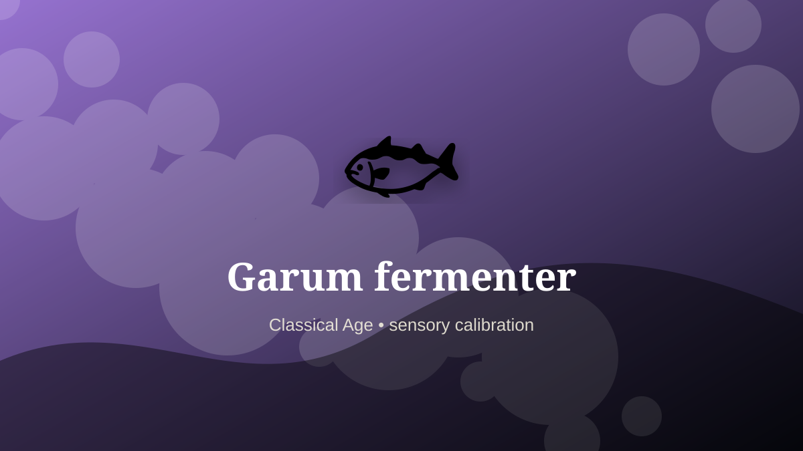

    ---
    title: "Garum fermenter"
    original_title: "Garum fermenter"
    era: "Classical Age"
    era_key: "classical"
    atlas_year_reference: "atlas anchor c. 500 BCE–500 CE"
    type: "weird"
    shelf: "sensory"
    evidence: "documented"
    representative_occurrence: "Roman Mediterranean"
    source_title: "British Museum: Romano-British lead curse tablet"
    source_url: "https://www.britishmuseum.org/collection/object/H_1978-0102-156"
    image: "../assets/images/069-garum-fermenter.svg"
    ---

    # Garum fermenter

    

    **Era:** Classical Age  
    **Atlas year reference:** atlas anchor c. 500 BCE–500 CE  
    **Type:** weird  
    **Evidence status:** documented  
    **Shelf:** sensory  
    **Representative occurrence:** Roman Mediterranean

    ## Accuracy boundary

    Historically attested role or closely attested work pattern. The wording avoids pretending every region used the same job title or routine.

    ## Rewritten card

    Garum fermenter turned perception into craft. Salting and fermenting fish parts produced a prized condiment and trade product. The process required time, vessels, judgment, and tolerance for odor.

The role depended on trained discrimination: color, sound, smell, texture, proportion, taste, surface, rhythm, or minute visual difference. Why it mattered: Controlled decomposition can create value.

Its unusual lesson is that a society often stores value in details too small or too subtle for an untrained observer to notice. Odd edge: Luxury sits one step away from rot.

Representative occurrence: Roman Mediterranean

Modern echo: fermentation industry

Reference lead: British Museum: Romano-British lead curse tablet — https://www.britishmuseum.org/collection/object/H_1978-0102-156

    ## Image guidance

    The included SVG is a local placeholder for offline viewing. For a final public atlas, replace it with a documented image where possible: museum object photo, archaeological reconstruction, historical illustration, workplace photograph, or clearly labeled concept art for speculative cards.

    ## Source lead

    - British Museum: Romano-British lead curse tablet: https://www.britishmuseum.org/collection/object/H_1978-0102-156
