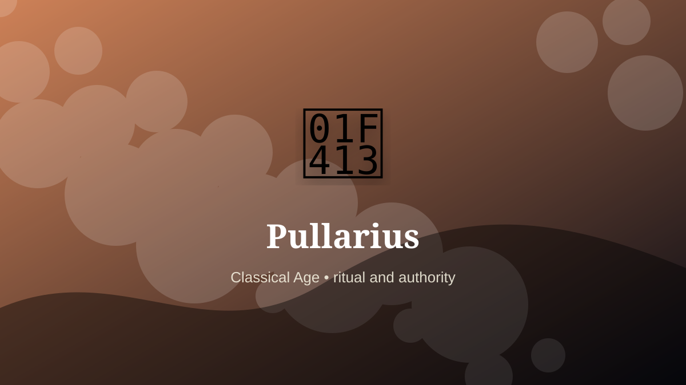

    ---
    title: "Pullarius"
    original_title: "Pullarius"
    era: "Classical Age"
    era_key: "classical"
    atlas_year_reference: "atlas anchor c. 500 BCE–500 CE"
    type: "weird"
    shelf: "ritual"
    evidence: "documented"
    representative_occurrence: "Roman world"
    source_title: "British Museum: Romano-British lead curse tablet"
    source_url: "https://www.britishmuseum.org/collection/object/H_1978-0102-156"
    image: "../assets/images/070-pullarius.svg"
    ---

    # Pullarius

    

    **Era:** Classical Age  
    **Atlas year reference:** atlas anchor c. 500 BCE–500 CE  
    **Type:** weird  
    **Evidence status:** documented  
    **Shelf:** ritual  
    **Representative occurrence:** Roman world

    ## Accuracy boundary

    Historically attested role or closely attested work pattern. The wording avoids pretending every region used the same job title or routine.

    ## Rewritten card

    Pullarius sits where technique and legitimacy touch. A Roman pullarius cared for sacred chickens and interpreted their feeding behavior for auspices, including in military contexts.

In the Classical Age, work like this cannot be separated cleanly from belief, law, memory, rank, or public trust. The craft mattered because it produced an outcome other people were willing to recognize as valid. Why it feels strange: Strategic decisions could hinge on poultry appetite.

The strange edge is this: A documented ritual office more than a craft workshop. The material act was only half the job. The other half was making the act socially legible.

Representative occurrence: Roman world

Modern echo: risk signaling

Reference lead: British Museum: Romano-British lead curse tablet — https://www.britishmuseum.org/collection/object/H_1978-0102-156

    ## Image guidance

    The included SVG is a local placeholder for offline viewing. For a final public atlas, replace it with a documented image where possible: museum object photo, archaeological reconstruction, historical illustration, workplace photograph, or clearly labeled concept art for speculative cards.

    ## Source lead

    - British Museum: Romano-British lead curse tablet: https://www.britishmuseum.org/collection/object/H_1978-0102-156
