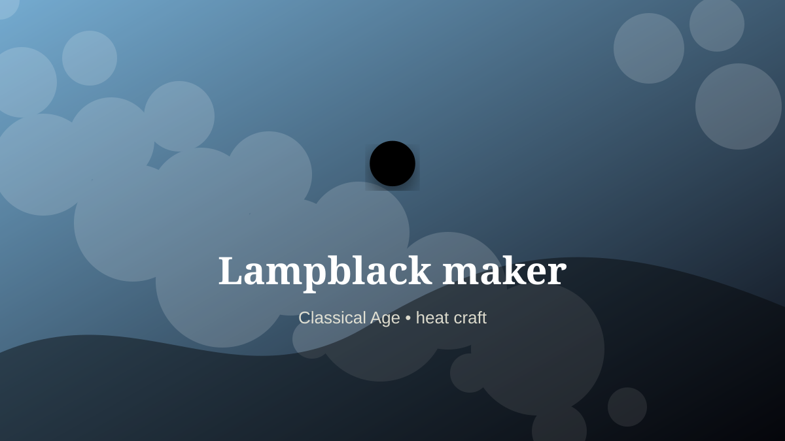

    ---
    title: "Lampblack maker"
    original_title: "Lampblack maker"
    era: "Classical Age"
    era_key: "classical"
    atlas_year_reference: "atlas anchor c. 500 BCE–500 CE"
    type: "weird"
    shelf: "fire"
    evidence: "documented"
    representative_occurrence: "many regions"
    source_title: "British Museum: Romano-British lead curse tablet"
    source_url: "https://www.britishmuseum.org/collection/object/H_1978-0102-156"
    image: "../assets/images/071-lampblack-maker.svg"
    ---

    # Lampblack maker

    

    **Era:** Classical Age  
    **Atlas year reference:** atlas anchor c. 500 BCE–500 CE  
    **Type:** weird  
    **Evidence status:** documented  
    **Shelf:** fire  
    **Representative occurrence:** many regions

    ## Accuracy boundary

    Historically attested role or closely attested work pattern. The wording avoids pretending every region used the same job title or routine.

    ## Rewritten card

    Lampblack maker was a material-intelligence role. Collecting fine soot from controlled flames supplied black pigment for ink, paint, and surface work.

The worker had to read behavior in heat, fracture, grain, airflow, moisture, season, wear, or chemical change. Why it mattered: Smoke becomes writing material.

This kind of craft preserves tacit knowledge: the timing, touch, color, sound, or resistance that tells a worker when a process has crossed the line from useful to ruined. Odd edge: The residue of light becomes durable image.

Representative occurrence: many regions

Modern echo: carbon black manufacture

Reference lead: British Museum: Romano-British lead curse tablet — https://www.britishmuseum.org/collection/object/H_1978-0102-156

    ## Image guidance

    The included SVG is a local placeholder for offline viewing. For a final public atlas, replace it with a documented image where possible: museum object photo, archaeological reconstruction, historical illustration, workplace photograph, or clearly labeled concept art for speculative cards.

    ## Source lead

    - British Museum: Romano-British lead curse tablet: https://www.britishmuseum.org/collection/object/H_1978-0102-156
