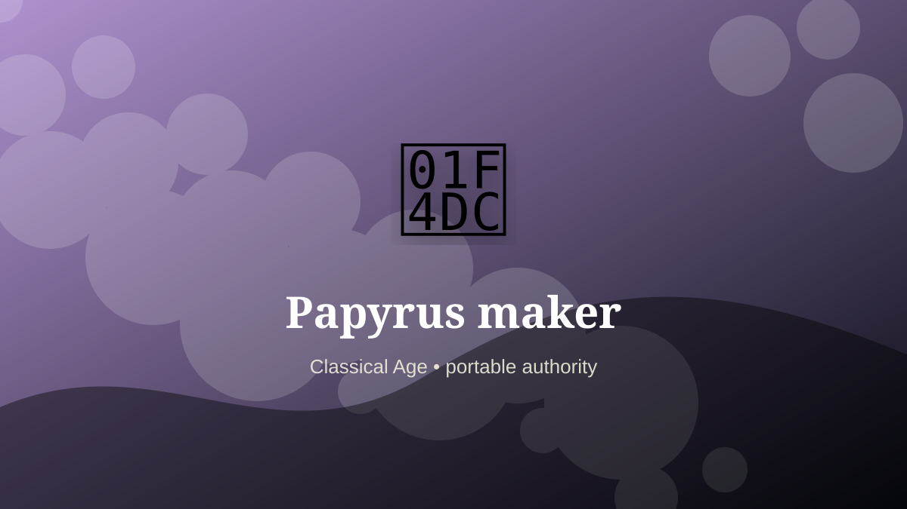

    ---
    title: "Papyrus maker"
    original_title: "Papyrus maker"
    era: "Classical Age"
    era_key: "classical"
    atlas_year_reference: "atlas anchor c. 500 BCE–500 CE"
    type: "mainstream"
    shelf: "authority"
    evidence: "documented"
    representative_occurrence: "Egypt and Mediterranean trade"
    source_title: "Smithsonian: Ancient Egyptian artifacts, mummies, and pyramids"
    source_url: "https://www.si.edu/spotlight/ancient-egypt"
    image: "../assets/images/072-papyrus-maker.svg"
    ---

    # Papyrus maker

    

    **Era:** Classical Age  
    **Atlas year reference:** atlas anchor c. 500 BCE–500 CE  
    **Type:** mainstream  
    **Evidence status:** documented  
    **Shelf:** authority  
    **Representative occurrence:** Egypt and Mediterranean trade

    ## Accuracy boundary

    Historically attested role or closely attested work pattern. The wording avoids pretending every region used the same job title or routine.

    ## Rewritten card

    Papyrus maker sits where technique and legitimacy touch. Slicing, layering, pressing, and drying plant strips produced a portable writing substrate for administration and literature.

In the Classical Age, work like this cannot be separated cleanly from belief, law, memory, rank, or public trust. The craft mattered because it produced an outcome other people were willing to recognize as valid. Why it mattered: Bureaucracy requires a surface.

The strange edge is this: A marsh plant becomes state memory. The material act was only half the job. The other half was making the act socially legible.

Representative occurrence: Egypt and Mediterranean trade

Modern echo: paper manufacture

Reference lead: Smithsonian: Ancient Egyptian artifacts, mummies, and pyramids — https://www.si.edu/spotlight/ancient-egypt

    ## Image guidance

    The included SVG is a local placeholder for offline viewing. For a final public atlas, replace it with a documented image where possible: museum object photo, archaeological reconstruction, historical illustration, workplace photograph, or clearly labeled concept art for speculative cards.

    ## Source lead

    - Smithsonian: Ancient Egyptian artifacts, mummies, and pyramids: https://www.si.edu/spotlight/ancient-egypt
