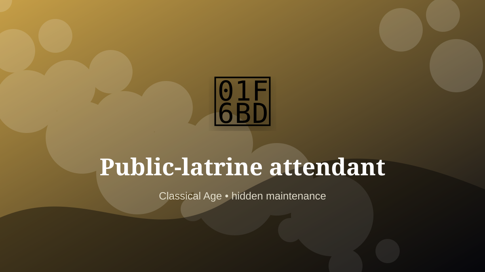

    ---
    title: "Public-latrine attendant"
    original_title: "Public-latrine attendant"
    era: "Classical Age"
    era_key: "classical"
    atlas_year_reference: "atlas anchor c. 500 BCE–500 CE"
    type: "weird"
    shelf: "filth"
    evidence: "borderland"
    representative_occurrence: "Roman urban contexts"
    source_title: "Newcastle Castle: Gong farmer"
    source_url: "https://www.newcastlecastle.co.uk/castle-blog/gong-farmer"
    image: "../assets/images/073-public-latrine-attendant.svg"
    ---

    # Public-latrine attendant

    

    **Era:** Classical Age  
    **Atlas year reference:** atlas anchor c. 500 BCE–500 CE  
    **Type:** weird  
    **Evidence status:** borderland  
    **Shelf:** filth  
    **Representative occurrence:** Roman urban contexts

    ## Accuracy boundary

    Reconstructed or localized role. The underlying practice or object is grounded, but the occupational boundary is not treated as universal.

    ## Rewritten card

    The important fact is not only what the worker made, but what became possible because the work was reliable. Public-latrine attendant handled the matter, hours, or spaces that more prestigious systems preferred not to face directly. Shared latrines created maintenance, cleaning, and fee-collection work around the least glamorous edge of urban life.

The work was necessary because settlements, markets, armies, workshops, and households produce residue. Evidence note: Specific arrangements varied by city and period.

This is hidden labor. It becomes visible only when it fails, when it smells, when it blocks movement, when disease spreads, or when a cleaner system has not yet been built. Modern echo: Infrastructure always generates custodial labor.

Representative occurrence: Roman urban contexts

Modern echo: sanitation operations

Reference lead: Newcastle Castle: Gong farmer — https://www.newcastlecastle.co.uk/castle-blog/gong-farmer

    ## Image guidance

    The included SVG is a local placeholder for offline viewing. For a final public atlas, replace it with a documented image where possible: museum object photo, archaeological reconstruction, historical illustration, workplace photograph, or clearly labeled concept art for speculative cards.

    ## Source lead

    - Newcastle Castle: Gong farmer: https://www.newcastlecastle.co.uk/castle-blog/gong-farmer
