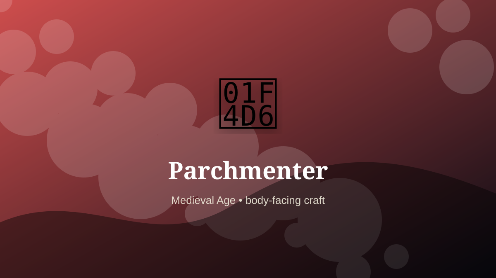

    ---
    title: "Parchmenter"
    original_title: "Parchmenter"
    era: "Medieval Age"
    era_key: "medieval"
    atlas_year_reference: "atlas anchor c. 500–1500 CE"
    type: "mainstream"
    shelf: "body"
    evidence: "documented"
    representative_occurrence: "Europe and Mediterranean"
    source_title: "British Museum: Vindolanda writing tablets"
    source_url: "https://www.britishmuseum.org/collection/galleries/roman-britain/vindolanda-tablets"
    image: "../assets/images/074-parchmenter.svg"
    ---

    # Parchmenter

    

    **Era:** Medieval Age  
    **Atlas year reference:** atlas anchor c. 500–1500 CE  
    **Type:** mainstream  
    **Evidence status:** documented  
    **Shelf:** body  
    **Representative occurrence:** Europe and Mediterranean

    ## Accuracy boundary

    Historically attested role or closely attested work pattern. The wording avoids pretending every region used the same job title or routine.

    ## Rewritten card

    Parchmenter required skill under bodily risk. Soaking, stretching, scraping, and drying animal skins created the writing surface behind many manuscripts.

The worker operated near injury, exposure, contamination, misclassification, pain, or irreversible change. Why it mattered: Knowledge rested on prepared tissue.

The value of the work came from judgment under conditions where a mistake could not always be undone. Odd edge: A book begins as an anatomical surface.

Representative occurrence: Europe and Mediterranean

Modern echo: archival substrates

Reference lead: British Museum: Vindolanda writing tablets — https://www.britishmuseum.org/collection/galleries/roman-britain/vindolanda-tablets

    ## Image guidance

    The included SVG is a local placeholder for offline viewing. For a final public atlas, replace it with a documented image where possible: museum object photo, archaeological reconstruction, historical illustration, workplace photograph, or clearly labeled concept art for speculative cards.

    ## Source lead

    - British Museum: Vindolanda writing tablets: https://www.britishmuseum.org/collection/galleries/roman-britain/vindolanda-tablets
