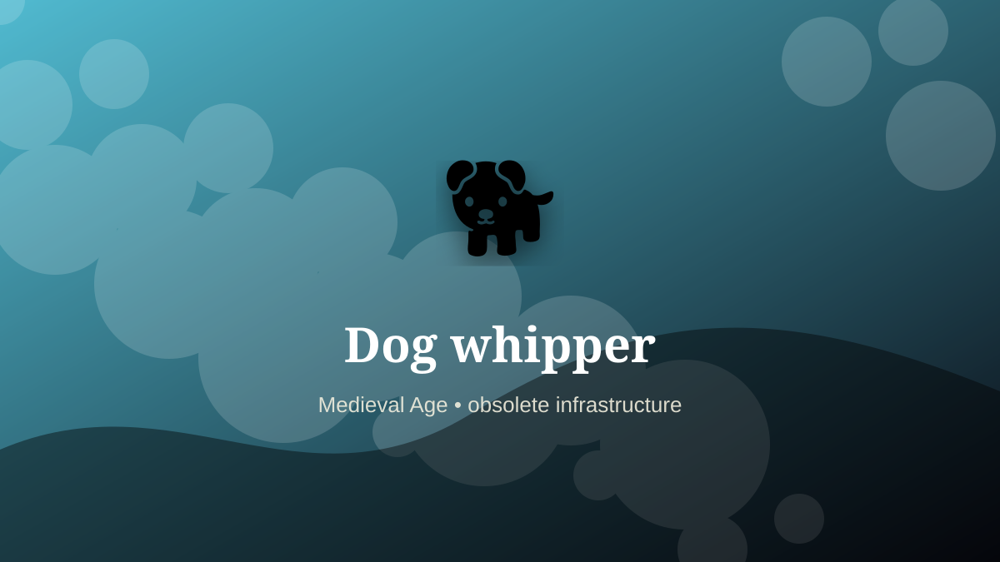

    ---
    title: "Dog whipper"
    original_title: "Dog whipper"
    era: "Medieval Age"
    era_key: "medieval"
    atlas_year_reference: "atlas anchor c. 500–1500 CE"
    type: "weird"
    shelf: "obsolete"
    evidence: "documented"
    representative_occurrence: "Britain, selected churches"
    source_title: "Country Life: obsolete occupations from dog whippers to mudlarks"
    source_url: "https://www.countrylife.co.uk/culture/what-happened-to-bottom-knockers-canine-bothering-dog-whippers-and-grime-caked-mudlarks"
    image: "../assets/images/075-dog-whipper.svg"
    ---

    # Dog whipper

    

    **Era:** Medieval Age  
    **Atlas year reference:** atlas anchor c. 500–1500 CE  
    **Type:** weird  
    **Evidence status:** documented  
    **Shelf:** obsolete  
    **Representative occurrence:** Britain, selected churches

    ## Accuracy boundary

    Historically attested role or closely attested work pattern. The wording avoids pretending every region used the same job title or routine.

    ## Rewritten card

    The role belongs to the zone where material skill becomes social order. Dog whipper was a practical specialist within the Medieval Age. Some churches employed people to remove disruptive dogs from services, often using a whip or tongs.

The craft mattered because it stabilized another activity: food, shelter, mobility, trade, recordkeeping, power, repair, or symbolic continuity. Why it feels strange: Sacred order required animal control.

The deeper lesson is that ordinary tools often hide extraordinary dependencies. Evidence note: Documented in selected British contexts, not a universal church office.

Representative occurrence: Britain, selected churches

Modern echo: venue operations

Reference lead: Country Life: obsolete occupations from dog whippers to mudlarks — https://www.countrylife.co.uk/culture/what-happened-to-bottom-knockers-canine-bothering-dog-whippers-and-grime-caked-mudlarks

    ## Image guidance

    The included SVG is a local placeholder for offline viewing. For a final public atlas, replace it with a documented image where possible: museum object photo, archaeological reconstruction, historical illustration, workplace photograph, or clearly labeled concept art for speculative cards.

    ## Source lead

    - Country Life: obsolete occupations from dog whippers to mudlarks: https://www.countrylife.co.uk/culture/what-happened-to-bottom-knockers-canine-bothering-dog-whippers-and-grime-caked-mudlarks
