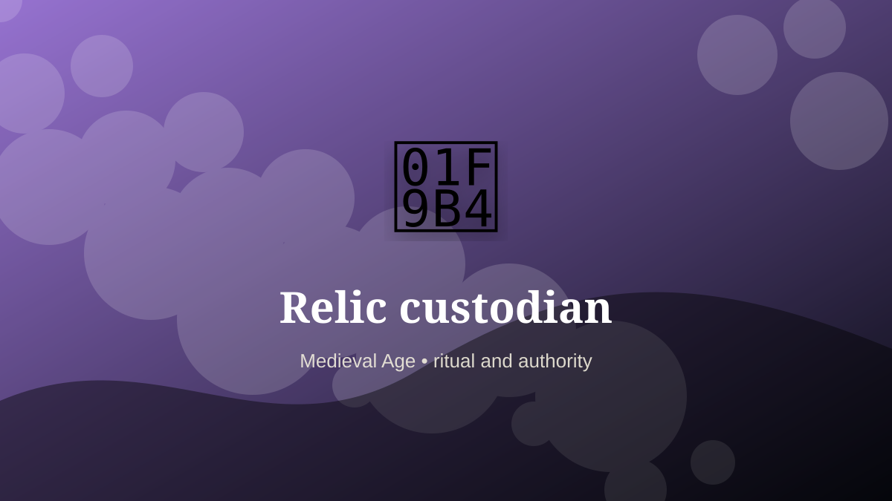

    ---
    title: "Relic custodian"
    original_title: "Relic custodian"
    era: "Medieval Age"
    era_key: "medieval"
    atlas_year_reference: "atlas anchor c. 500–1500 CE"
    type: "weird"
    shelf: "ritual"
    evidence: "borderland"
    representative_occurrence: "medieval Christian contexts"
    source_title: "British Museum: Romano-British lead curse tablet"
    source_url: "https://www.britishmuseum.org/collection/object/H_1978-0102-156"
    image: "../assets/images/077-relic-custodian.svg"
    ---

    # Relic custodian

    

    **Era:** Medieval Age  
    **Atlas year reference:** atlas anchor c. 500–1500 CE  
    **Type:** weird  
    **Evidence status:** borderland  
    **Shelf:** ritual  
    **Representative occurrence:** medieval Christian contexts

    ## Accuracy boundary

    Reconstructed or localized role. The underlying practice or object is grounded, but the occupational boundary is not treated as universal.

    ## Rewritten card

    Relic custodian sits where technique and legitimacy touch. Managing, displaying, protecting, and authenticating relics required a blend of treasury work, ceremonial timing, and narrative authority.

In the Medieval Age, work like this cannot be separated cleanly from belief, law, memory, rank, or public trust. The craft mattered because it produced an outcome other people were willing to recognize as valid. Why it mattered: A fragment could anchor pilgrimage economies.

The strange edge is this: Meaning changes the value of matter. The material act was only half the job. The other half was making the act socially legible.

Representative occurrence: medieval Christian contexts

Modern echo: collection management

Reference lead: British Museum: Romano-British lead curse tablet — https://www.britishmuseum.org/collection/object/H_1978-0102-156

    ## Image guidance

    The included SVG is a local placeholder for offline viewing. For a final public atlas, replace it with a documented image where possible: museum object photo, archaeological reconstruction, historical illustration, workplace photograph, or clearly labeled concept art for speculative cards.

    ## Source lead

    - British Museum: Romano-British lead curse tablet: https://www.britishmuseum.org/collection/object/H_1978-0102-156
