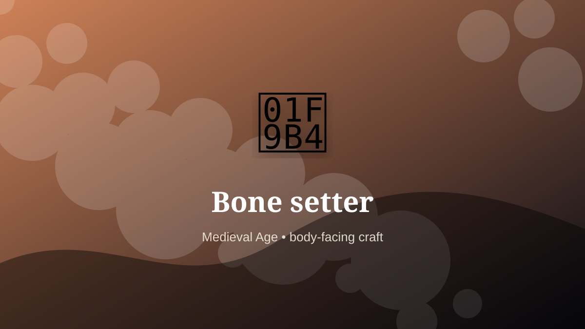

    ---
    title: "Bone setter"
    original_title: "Bone setter"
    era: "Medieval Age"
    era_key: "medieval"
    atlas_year_reference: "atlas anchor c. 500–1500 CE"
    type: "weird"
    shelf: "body"
    evidence: "documented"
    representative_occurrence: "many regions"
    source_title: "Wellcome Collection text archive: historical medicine context"
    source_url: "https://api.wellcomecollection.org/text/v1/b21443348"
    image: "../assets/images/078-bone-setter.svg"
    ---

    # Bone setter

    

    **Era:** Medieval Age  
    **Atlas year reference:** atlas anchor c. 500–1500 CE  
    **Type:** weird  
    **Evidence status:** documented  
    **Shelf:** body  
    **Representative occurrence:** many regions

    ## Accuracy boundary

    Historically attested role or closely attested work pattern. The wording avoids pretending every region used the same job title or routine.

    ## Rewritten card

    Bone setter required skill under bodily risk. Practical treatment of fractures and dislocations often lived outside learned medicine, relying on manual skill, splinting, and apprenticeship.

The worker operated near injury, exposure, contamination, misclassification, pain, or irreversible change. Evidence note: A longstanding practical role with variable status.

The value of the work came from judgment under conditions where a mistake could not always be undone. Modern echo: Embodied skill persists alongside formal medicine.

Representative occurrence: many regions

Modern echo: orthopedic care

Reference lead: Wellcome Collection text archive: historical medicine context — https://api.wellcomecollection.org/text/v1/b21443348

    ## Image guidance

    The included SVG is a local placeholder for offline viewing. For a final public atlas, replace it with a documented image where possible: museum object photo, archaeological reconstruction, historical illustration, workplace photograph, or clearly labeled concept art for speculative cards.

    ## Source lead

    - Wellcome Collection text archive: historical medicine context: https://api.wellcomecollection.org/text/v1/b21443348
