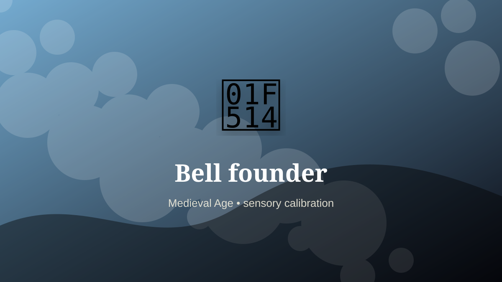

    ---
    title: "Bell founder"
    original_title: "Bell founder"
    era: "Medieval Age"
    era_key: "medieval"
    atlas_year_reference: "atlas anchor c. 500–1500 CE"
    type: "mainstream"
    shelf: "sensory"
    evidence: "documented"
    representative_occurrence: "Europe and elsewhere"
    source_title: "British Museum: Romano-British lead curse tablet"
    source_url: "https://www.britishmuseum.org/collection/object/H_1978-0102-156"
    image: "../assets/images/079-bell-founder.svg"
    ---

    # Bell founder

    

    **Era:** Medieval Age  
    **Atlas year reference:** atlas anchor c. 500–1500 CE  
    **Type:** mainstream  
    **Evidence status:** documented  
    **Shelf:** sensory  
    **Representative occurrence:** Europe and elsewhere

    ## Accuracy boundary

    Historically attested role or closely attested work pattern. The wording avoids pretending every region used the same job title or routine.

    ## Rewritten card

    Bell founder turned perception into craft. Casting large bells combined alloy control, mold construction, transport, tuning, and architectural coordination.

The role depended on trained discrimination: color, sound, smell, texture, proportion, taste, surface, rhythm, or minute visual difference. Why it mattered: Sound organized territory and time.

Its unusual lesson is that a society often stores value in details too small or too subtle for an untrained observer to notice. Odd edge: A town’s clock could be molten metal.

Representative occurrence: Europe and elsewhere

Modern echo: acoustic engineering

Reference lead: British Museum: Romano-British lead curse tablet — https://www.britishmuseum.org/collection/object/H_1978-0102-156

    ## Image guidance

    The included SVG is a local placeholder for offline viewing. For a final public atlas, replace it with a documented image where possible: museum object photo, archaeological reconstruction, historical illustration, workplace photograph, or clearly labeled concept art for speculative cards.

    ## Source lead

    - British Museum: Romano-British lead curse tablet: https://www.britishmuseum.org/collection/object/H_1978-0102-156
