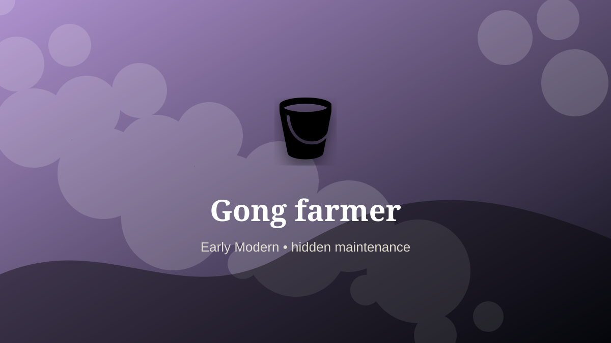

    ---
    title: "Gong farmer"
    original_title: "Gong farmer"
    era: "Early Modern"
    era_key: "earlymodern"
    atlas_year_reference: "atlas bridge c. 1500–1750 CE"
    type: "weird"
    shelf: "filth"
    evidence: "documented"
    representative_occurrence: "Tudor and early modern England"
    source_title: "Newcastle Castle: Gong farmer"
    source_url: "https://www.newcastlecastle.co.uk/castle-blog/gong-farmer"
    image: "../assets/images/080-gong-farmer.svg"
    ---

    # Gong farmer

    

    **Era:** Early Modern  
    **Atlas year reference:** atlas bridge c. 1500–1750 CE  
    **Type:** weird  
    **Evidence status:** documented  
    **Shelf:** filth  
    **Representative occurrence:** Tudor and early modern England

    ## Accuracy boundary

    Historically attested role or closely attested work pattern. The wording avoids pretending every region used the same job title or routine.

    ## Rewritten card

    The role belongs to the zone where material skill becomes social order. Gong farmer handled the matter, hours, or spaces that more prestigious systems preferred not to face directly. Removing human waste from privies and cesspits was essential urban work. In Tudor England, gong farmers were associated with night labor and severe confined-space hazards.

The work was necessary because settlements, markets, armies, workshops, and households produce residue. Why it mattered: Sanitation existed before sewers.

This is hidden labor. It becomes visible only when it fails, when it smells, when it blocks movement, when disease spreads, or when a cleaner system has not yet been built. Modern echo: Vacuum trucks mechanize the same necessity.

Representative occurrence: Tudor and early modern England

Modern echo: wastewater operations

Reference lead: Newcastle Castle: Gong farmer — https://www.newcastlecastle.co.uk/castle-blog/gong-farmer

    ## Image guidance

    The included SVG is a local placeholder for offline viewing. For a final public atlas, replace it with a documented image where possible: museum object photo, archaeological reconstruction, historical illustration, workplace photograph, or clearly labeled concept art for speculative cards.

    ## Source lead

    - Newcastle Castle: Gong farmer: https://www.newcastlecastle.co.uk/castle-blog/gong-farmer
