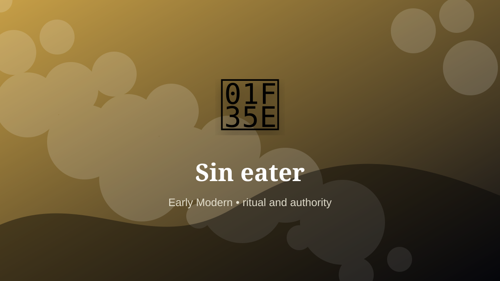

    ---
    title: "Sin eater"
    original_title: "Sin eater"
    era: "Early Modern"
    era_key: "earlymodern"
    atlas_year_reference: "atlas bridge c. 1500–1750 CE"
    type: "weird"
    shelf: "ritual"
    evidence: "borderland"
    representative_occurrence: "reported in parts of Britain"
    source_title: "Country Life: obsolete occupations from dog whippers to mudlarks"
    source_url: "https://www.countrylife.co.uk/culture/what-happened-to-bottom-knockers-canine-bothering-dog-whippers-and-grime-caked-mudlarks"
    image: "../assets/images/081-sin-eater.svg"
    ---

    # Sin eater

    

    **Era:** Early Modern  
    **Atlas year reference:** atlas bridge c. 1500–1750 CE  
    **Type:** weird  
    **Evidence status:** borderland  
    **Shelf:** ritual  
    **Representative occurrence:** reported in parts of Britain

    ## Accuracy boundary

    Reconstructed or localized role. The underlying practice or object is grounded, but the occupational boundary is not treated as universal.

    ## Rewritten card

    Sin eater sits where technique and legitimacy touch. A reported funerary custom in parts of Britain involved eating food associated with the dead in a symbolic transfer of burden.

In the Early Modern, work like this cannot be separated cleanly from belief, law, memory, rank, or public trust. The craft mattered because it produced an outcome other people were willing to recognize as valid. Evidence note: Treat as borderland folklore and localized practice, not a standardized trade.

The strange edge is this: Food becomes a vessel for moral transfer. The material act was only half the job. The other half was making the act socially legible.

Representative occurrence: reported in parts of Britain

Modern echo: ritual service

Reference lead: Country Life: obsolete occupations from dog whippers to mudlarks — https://www.countrylife.co.uk/culture/what-happened-to-bottom-knockers-canine-bothering-dog-whippers-and-grime-caked-mudlarks

    ## Image guidance

    The included SVG is a local placeholder for offline viewing. For a final public atlas, replace it with a documented image where possible: museum object photo, archaeological reconstruction, historical illustration, workplace photograph, or clearly labeled concept art for speculative cards.

    ## Source lead

    - Country Life: obsolete occupations from dog whippers to mudlarks: https://www.countrylife.co.uk/culture/what-happened-to-bottom-knockers-canine-bothering-dog-whippers-and-grime-caked-mudlarks
