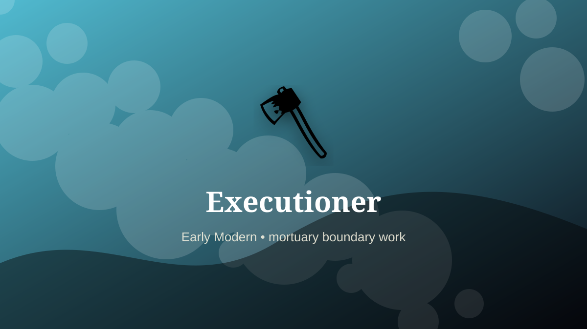

    ---
    title: "Executioner"
    original_title: "Executioner"
    era: "Early Modern"
    era_key: "earlymodern"
    atlas_year_reference: "atlas bridge c. 1500–1750 CE"
    type: "weird"
    shelf: "death"
    evidence: "documented"
    representative_occurrence: "many regions"
    source_title: "The National Archives: Body Snatchers"
    source_url: "https://www.nationalarchives.gov.uk/education/resources/body-snatchers/"
    image: "../assets/images/083-executioner.svg"
    ---

    # Executioner

    

    **Era:** Early Modern  
    **Atlas year reference:** atlas bridge c. 1500–1750 CE  
    **Type:** weird  
    **Evidence status:** documented  
    **Shelf:** death  
    **Representative occurrence:** many regions

    ## Accuracy boundary

    Historically attested role or closely attested work pattern. The wording avoids pretending every region used the same job title or routine.

    ## Rewritten card

    Executioner sits where technique and legitimacy touch. Carrying out corporal and capital punishment required tools, choreography, legal timing, and social separation.

In the Early Modern, work like this cannot be separated cleanly from belief, law, memory, rank, or public trust. The craft mattered because it produced an outcome other people were willing to recognize as valid. Why it feels strange: The state outsources violence to a specialized hand.

The strange edge is this: Technical competence and stigma coexist. The material act was only half the job. The other half was making the act socially legible.

Representative occurrence: many regions

Modern echo: regulated force

Reference lead: The National Archives: Body Snatchers — https://www.nationalarchives.gov.uk/education/resources/body-snatchers/

    ## Image guidance

    The included SVG is a local placeholder for offline viewing. For a final public atlas, replace it with a documented image where possible: museum object photo, archaeological reconstruction, historical illustration, workplace photograph, or clearly labeled concept art for speculative cards.

    ## Source lead

    - The National Archives: Body Snatchers: https://www.nationalarchives.gov.uk/education/resources/body-snatchers/
