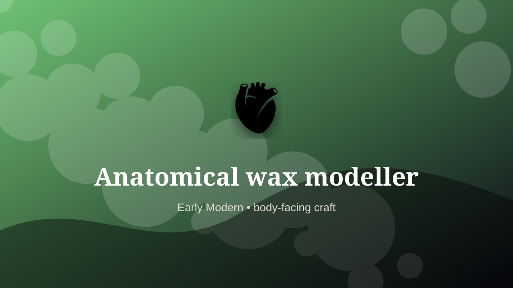

    ---
    title: "Anatomical wax modeller"
    original_title: "Anatomical wax modeller"
    era: "Early Modern"
    era_key: "earlymodern"
    atlas_year_reference: "atlas bridge c. 1500–1750 CE"
    type: "weird"
    shelf: "body"
    evidence: "documented"
    representative_occurrence: "European medical collections"
    source_title: "Wellcome Collection text archive: historical medicine context"
    source_url: "https://api.wellcomecollection.org/text/v1/b21443348"
    image: "../assets/images/084-anatomical-wax-modeller.svg"
    ---

    # Anatomical wax modeller

    

    **Era:** Early Modern  
    **Atlas year reference:** atlas bridge c. 1500–1750 CE  
    **Type:** weird  
    **Evidence status:** documented  
    **Shelf:** body  
    **Representative occurrence:** European medical collections

    ## Accuracy boundary

    Historically attested role or closely attested work pattern. The wording avoids pretending every region used the same job title or routine.

    ## Rewritten card

    Anatomical wax modeller required skill under bodily risk. Wax anatomical models translated dissection, observation, and teaching into durable, sometimes highly theatrical objects.

The worker operated near injury, exposure, contamination, misclassification, pain, or irreversible change. Why it mattered: A body could be studied without a fresh body.

The value of the work came from judgment under conditions where a mistake could not always be undone. Modern echo: Medical simulation and digital twins.

Representative occurrence: European medical collections

Modern echo: medical simulation

Reference lead: Wellcome Collection text archive: historical medicine context — https://api.wellcomecollection.org/text/v1/b21443348

    ## Image guidance

    The included SVG is a local placeholder for offline viewing. For a final public atlas, replace it with a documented image where possible: museum object photo, archaeological reconstruction, historical illustration, workplace photograph, or clearly labeled concept art for speculative cards.

    ## Source lead

    - Wellcome Collection text archive: historical medicine context: https://api.wellcomecollection.org/text/v1/b21443348
