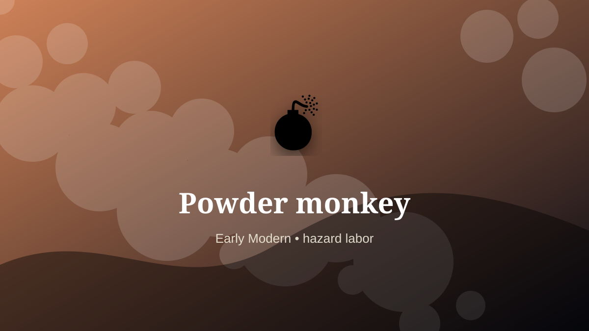

    ---
    title: "Powder monkey"
    original_title: "Powder monkey"
    era: "Early Modern"
    era_key: "earlymodern"
    atlas_year_reference: "atlas bridge c. 1500–1750 CE"
    type: "weird"
    shelf: "danger"
    evidence: "documented"
    representative_occurrence: "naval contexts"
    source_title: "Country Life: obsolete occupations from dog whippers to mudlarks"
    source_url: "https://www.countrylife.co.uk/culture/what-happened-to-bottom-knockers-canine-bothering-dog-whippers-and-grime-caked-mudlarks"
    image: "../assets/images/086-powder-monkey.svg"
    ---

    # Powder monkey

    

    **Era:** Early Modern  
    **Atlas year reference:** atlas bridge c. 1500–1750 CE  
    **Type:** weird  
    **Evidence status:** documented  
    **Shelf:** danger  
    **Representative occurrence:** naval contexts

    ## Accuracy boundary

    Historically attested role or closely attested work pattern. The wording avoids pretending every region used the same job title or routine.

    ## Rewritten card

    Powder monkey required skill under bodily risk. Young workers on warships carried gunpowder charges from storage to guns during battle.

The worker operated near injury, exposure, contamination, misclassification, pain, or irreversible change. Why it mattered: Naval firepower depended on hazardous human relays.

The value of the work came from judgment under conditions where a mistake could not always be undone. Odd edge: Logistics enters the blast radius.

Representative occurrence: naval contexts

Modern echo: hazardous materials logistics

Reference lead: Country Life: obsolete occupations from dog whippers to mudlarks — https://www.countrylife.co.uk/culture/what-happened-to-bottom-knockers-canine-bothering-dog-whippers-and-grime-caked-mudlarks

    ## Image guidance

    The included SVG is a local placeholder for offline viewing. For a final public atlas, replace it with a documented image where possible: museum object photo, archaeological reconstruction, historical illustration, workplace photograph, or clearly labeled concept art for speculative cards.

    ## Source lead

    - Country Life: obsolete occupations from dog whippers to mudlarks: https://www.countrylife.co.uk/culture/what-happened-to-bottom-knockers-canine-bothering-dog-whippers-and-grime-caked-mudlarks
