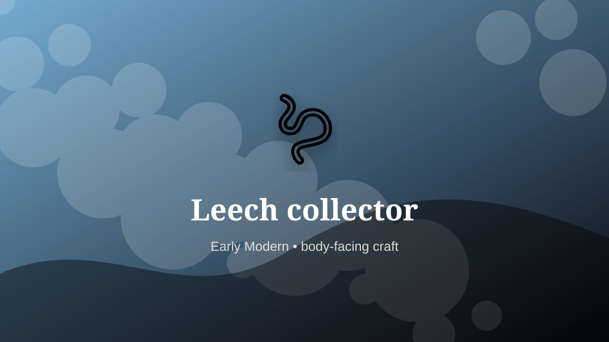

    ---
    title: "Leech collector"
    original_title: "Leech collector"
    era: "Early Modern"
    era_key: "earlymodern"
    atlas_year_reference: "atlas bridge c. 1500–1750 CE"
    type: "weird"
    shelf: "body"
    evidence: "documented"
    representative_occurrence: "Europe and elsewhere"
    source_title: "Wellcome Collection text archive: historical medicine context"
    source_url: "https://api.wellcomecollection.org/text/v1/b21443348"
    image: "../assets/images/087-leech-collector.svg"
    ---

    # Leech collector

    

    **Era:** Early Modern  
    **Atlas year reference:** atlas bridge c. 1500–1750 CE  
    **Type:** weird  
    **Evidence status:** documented  
    **Shelf:** body  
    **Representative occurrence:** Europe and elsewhere

    ## Accuracy boundary

    Historically attested role or closely attested work pattern. The wording avoids pretending every region used the same job title or routine.

    ## Rewritten card

    Leech collector required skill under bodily risk. Gathering medicinal leeches from wetlands supplied a large therapeutic market. Collection could involve attracting leeches onto exposed skin.

The worker operated near injury, exposure, contamination, misclassification, pain, or irreversible change. Why it feels strange: The worker becomes bait for medical inventory.

The value of the work came from judgment under conditions where a mistake could not always be undone. Modern echo: Biological collection remains a specialized supply chain.

Representative occurrence: Europe and elsewhere

Modern echo: biological sourcing

Reference lead: Wellcome Collection text archive: historical medicine context — https://api.wellcomecollection.org/text/v1/b21443348

    ## Image guidance

    The included SVG is a local placeholder for offline viewing. For a final public atlas, replace it with a documented image where possible: museum object photo, archaeological reconstruction, historical illustration, workplace photograph, or clearly labeled concept art for speculative cards.

    ## Source lead

    - Wellcome Collection text archive: historical medicine context: https://api.wellcomecollection.org/text/v1/b21443348
